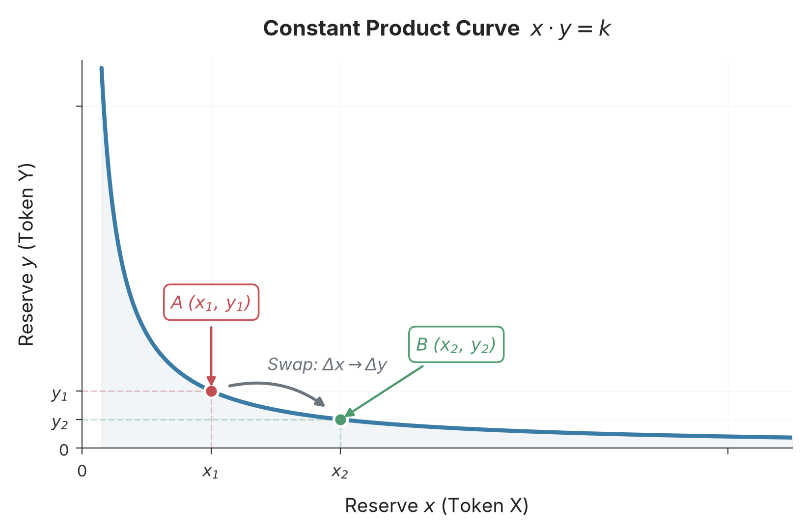

# Constant Product Market Maker

Due to the characteristics of blockchain transactions, the order book model widely used by centralized exchanges (CEX) no longer applies in an on-chain environment, and decentralized exchanges (DEX) must explore a trading model suited to the blockchain. Uniswap adopts the constant product market maker (CPMM) model. This chapter discusses the theory behind CPMM, laying the foundation for the subsequent chapters' in-depth treatment of Uniswap's contract implementation.

## Background and Motivation

In financial markets, a **market maker** is an institution or individual that continuously provides **liquidity** for an asset. Liquidity refers to the ability of an asset to be bought and sold quickly at a reasonable price. In a market with good liquidity, traders can complete transactions at prices close to the current market price at any time, with minimal price impact even for large trades. In a market with poor liquidity, traders may need to wait a long time to find a counterparty, or be forced to accept prices far from the market price.

Centralized exchanges generally adopt the order book model, in which both market makers and ordinary traders submit orders through the order book. The order book records all outstanding buy and sell orders: a **bid** represents a buyer's offer to purchase a certain quantity of an asset at a specific price, and an **ask** represents a seller's offer to sell a certain quantity of an asset at a specific price; when a bid price is greater than or equal to an ask price, the exchange automatically matches them for execution. The exchange pushes the latest outstanding order information to the entire market in real time. Figure 1 shows an illustration of the order book for an ETH/USDC trading pair.

*Figure 1　The order book of an ETH/USDC trading pair (illustrative). The upper section shows asks in red; the lower section shows bids in green; the left side shows prices (in USDC) and the right side shows order quantities (in ETH). The difference between the lowest ask and the highest bid is the spread. By continuously placing orders on both the buy and sell sides to capture this spread, a market maker provides liquidity to the market, and the spread is the market's reward for doing so.*

With market makers, traders do not need to wait for a counterparty to appear; they can trade with a market maker at any time. Because this is profitable, a market typically has multiple market makers competing with one another. Competition drives spreads narrower, and by continuously quoting, market makers absorb buying and selling pressure, reducing sharp price movements and contributing to market stability.

Because centralized exchanges or brokerages provide unified API services, the cost of submitting orders is almost negligible, so the order book model works well in centralized exchanges (such as Binance and Coinbase). In a decentralized blockchain environment, however, it is difficult to apply, mainly for two reasons. On one hand, transaction costs are high: every order placement, cancellation, and matching entails a change to the blockchain state and thus requires an on-chain transaction, so gas fees must be paid. This is especially true for market makers, who typically need to adjust quotes frequently; the cost of performing such operations on-chain is almost unacceptable. On the other hand, execution is slow: block confirmation times (about 12 seconds on Ethereum) are far slower than centralized exchanges (microsecond-level), preventing market makers from responding to market changes in a timely manner. To overcome these drawbacks, decentralized exchanges explored and developed the **automated market maker (AMM)** mechanism.

An automated market maker has no order book; in its place is a **pool** that holds two assets to be swapped (such as ETH and USDC). Without an order book, the trading price of an asset is no longer determined by outstanding bids or asks, but by the reserves of the two assets in the pool and a mathematical formula. A market maker no longer makes a market by placing buy and sell orders; instead, it deposits both assets into the pool simultaneously, providing liquidity for asset trades within the pool, and is therefore called a **liquidity provider (LP)**. Its market-making reward is no longer the bid-ask spread earned from buying low and selling high, but other rewards stipulated by the market-making mechanism (such as trading fees, liquidity mining returns, and so on).

There are various automated market maker models. Different models define different price curves and liquidity distribution characteristics, suited to different trading scenarios. Uniswap adopts the constant product market maker model. Thanks to its concise mathematical form, good price discovery properties, and generality for any token pair, this model has become the most widely adopted AMM model. As the most successful DEX protocol, Uniswap is built on CPMM.

## Definition

Suppose a pool contains two tokens X and Y, with quantities $x$ and $y$ respectively. The constant product formula states:

$$x \cdot y = k \tag{1}$$

where $k$ is a constant. We call the quantities $x$ and $y$ of tokens X and Y in the pool the **reserves**; the operation of a user depositing one token into the pool in exchange for another is called a **swap**; and the quantity $k = x \cdot y$ that remains constant throughout trading is called the **invariant**. On this basis, two quantities measuring the state of the pool can also be defined: $L = \sqrt{xy} = \sqrt{k}$ measures the total scale of funds in the pool and is called the liquidity; $P = y/x$ denotes the **price** of token X relative to token Y, that is, how many units of Y one unit of X exchanges for.

On the plane with $x$ and $y$ as coordinate axes, $x \cdot y = k$ is a hyperbola, as shown in Figure 2.

*Figure 2　The constant product curve $x \cdot y = k$. The product of the coordinates at any point on the curve is always equal to the constant $k$. A swap moves the pool's state along the curve from point A to point B, depositing $\Delta x$ while withdrawing $\Delta y$, yet the product of the two always remains unchanged.*

## Swap

For the CPMM model, the core constraint during a swap is:

> A swap does not change liquidity; that is, before and after a swap, the product of the asset reserves $k$ is constant.

Suppose a user wants to swap $\Delta x$ of token X for token Y. After the swap, the quantity of token X in the pool becomes $x + \Delta x$, while the quantity of token Y must decrease by $\Delta y$. According to the constant product constraint:

$$(x + \Delta x)(y - \Delta y) = k = x \cdot y \tag{2}$$

Some algebraic manipulation yields:

$$\Delta y = \frac{\Delta x \cdot y}{x + \Delta x} \tag{3}$$

Likewise, if a user wants to swap $\Delta y$ of token Y for token X, then

$$\Delta x = \frac{\Delta y \cdot x}{y + \Delta y} \tag{4}$$

This is the core swap formula of CPMM: the amount of token that can be obtained is entirely determined by the input amount and the reserves in the pool. When swapping one token for another, the demand for the token being obtained increases, and its price rises accordingly. Taking the swap of token Y for token X as an example, the original price of X is $P = y/x$, and after the swap it becomes

$$P' = \frac{y + \Delta y}{x - \Delta x} > P \tag{5}$$

indicating that the price of X rises (and by the same reasoning, the price of Y falls). This property is consistent with the law of supply and demand: greater demand for an asset raises its price, and vice versa.

Since the swap amount depends only on the input amount and the reserves in the pool, and the reserves are related to price and liquidity by:

$$\sqrt{xy} = L \tag{6}$$

$$P = y/x \tag{7}$$

the swap amount $\Delta x$ or $\Delta y$ can also be expressed as a function of liquidity and price:

$$\Delta x = \frac{\Delta L}{\sqrt{P}}, \quad \Delta y = \Delta L\sqrt{P} \tag{8}$$

## Liquidity Management

To ensure there are sufficient tokens in the pool for swapping, liquidity providers must add assets to the pool; this process is called **adding liquidity**. Conversely, when a liquidity provider wants to reduce the assets in the pool, it must remove assets from the pool; this process is called **removing liquidity**. Whether adding or removing liquidity, both involve a change in the quantities of the two assets, and this change is not arbitrary. Its core constraint is:

> Adding or removing liquidity does not change the current price of the assets.

### Adding Liquidity

Suppose the pool currently holds $x$ of token X and $y$ of token Y, with price $P = y/x$ and liquidity $L = \sqrt{xy}$. An LP wants to add $\Delta x$ of token X and $\Delta y$ of token Y. According to the core constraint, the price must be equal before and after adding liquidity:

$$\frac{y}{x} = \frac{y + \Delta y}{x + \Delta x} = P \tag{9}$$

Slightly rearranging Equation (9) gives the following relation:

$$\frac{\Delta y}{\Delta x} = \frac{y}{x} = P \tag{10}$$

That is, $\Delta y = \Delta x \cdot P$. The LP cannot freely choose the quantities of the two tokens to provide; they must strictly follow the current price ratio.

Equation (10) shows that, when the assets already have reserves, the two assets provided when adding liquidity must be proportional, and the ratio is exactly the current price. Given this constraint, the quantities $\Delta x$ and $\Delta y$ are determined; since both quantities are determined, their product is a constant. Let:

$$\Delta x \Delta y = (\Delta L)^2 \tag{11}$$

Combining Equations (10) and (11), we can write:

$$\Delta L = \Delta x\sqrt{P} = \Delta x\sqrt{\frac{y}{x}} = \Delta x\sqrt{\frac{xy}{x^2}} = L\frac{\Delta x}{x} \tag{12}$$

By the same reasoning:

$$\Delta L = \frac{\Delta y}{\sqrt{P}} = \frac{\Delta y}{\sqrt{\frac{y}{x}}} = \frac{\Delta y}{\sqrt{\frac{y^2}{xy}}} = L\frac{\Delta y}{y} \tag{13}$$

Combining Equations (12) and (13), after the LP adds assets, the new liquidity $L'$ satisfies:

$$L'^2 = (x + \Delta x)(y + \Delta y) = (L + \Delta L)^2 \tag{14}$$

Equation (14) shows that $\Delta L$ can be regarded as a liquidity increment; that is, on top of the original liquidity, the LP injects $\Delta L$ of liquidity into the pool.

### Removing Liquidity

When adding liquidity, both $\Delta x$ and $\Delta y$ are greater than 0; removing liquidity is the inverse operation of adding liquidity, and in this case $\Delta x$, $\Delta y$ (and $\Delta L$) are all less than 0. According to the core constraint, removing liquidity likewise does not change the price, so Equation (9) still holds. Inverting Equations (12) and (13) for adding liquidity gives the reserves the LP receives when removing liquidity:

$$\Delta x = \frac{\Delta L}{L} \cdot x \tag{15}$$

$$\Delta y = \frac{\Delta L}{L} \cdot y \tag{16}$$

where $x$ and $y$ are the token reserves in the pool at the time of removal.

Alternatively, expressed as a relation between $P$ and $L$:

$$\Delta x = \frac{\Delta L}{\sqrt{P}} \tag{17}$$

$$\Delta y = \Delta L\sqrt{P} \tag{18}$$

Equations (15) and (16) show that the LP receives both tokens in proportion to the liquidity share it holds.

Note that during the period between depositing and withdrawing liquidity, the quantities of tokens in the pool may have changed due to swaps, so the $\Delta x$ and $\Delta y$ received often differ from the quantities originally provided when adding liquidity.

## Impermanent Loss

When a liquidity provider deposits tokens into a pool, if the price of the tokens in the pool changes, the total value of the tokens the LP deposited will be lower than the value of "simply holding" (that is, doing nothing and keeping the tokens in a wallet). This difference is called **impermanent loss (IL)**.

Suppose the pool holds $x$ ETH and $y$ USDC, with price $P_0 = y/x$. The LP deposits $\Delta x$ ETH and $\Delta y$ USDC into the pool.

By Equation (10), the two assets deposited must be proportional to the current price: $\Delta y = \Delta x \cdot P_0$. At the same time, by Equation (12), this deposit contributes liquidity $\Delta L = \Delta x\sqrt{P_0}$ to the LP.

As the market changes, the price of the assets in the pool becomes $P$. If the LP removes liquidity at this point, then by Equations (6) and (7), the share of liquidity $\Delta L$ held by the LP corresponds to $\Delta L/\sqrt{P}$ ETH and $\Delta L\sqrt{P}$ USDC at price $P$, and its value denominated in USDC is:

$$V = \frac{\Delta L}{\sqrt{P}} \cdot P + \Delta L\sqrt{P} = \Delta L\sqrt{P} + \Delta L\sqrt{P} = 2\Delta L\sqrt{P} \tag{19}$$

Substituting Equation (12):

$$V = 2\Delta x\sqrt{P_0}\sqrt{P} = 2\Delta x\sqrt{P_0 P} \tag{20}$$

If the LP does not deposit into the pool but instead keeps the $\Delta x$ ETH and $\Delta y$ USDC in a wallet, then when the price becomes $P$, the value of these assets (also denominated in USDC) is:

$$V' = \Delta x \cdot P + \Delta y = \Delta x(P + P_0) \tag{21}$$

Define the price change ratio $r = P / P_0$: $r = 1$ means the price is unchanged, $r > 1$ means ETH has appreciated, and $r < 1$ means ETH has depreciated. Taking the ratio of Equations (20) and (21) and substituting $P = r P_0$:

$$\frac{V}{V'} = \frac{2\Delta x\sqrt{P_0 \cdot r P_0}}{\Delta x(r P_0 + P_0)} = \frac{2\sqrt{r}}{r + 1} \tag{22}$$

Therefore, the impermanent loss ratio is:

$$\text{IL} = 1 - \frac{V}{V'} = 1 - \frac{2\sqrt{r}}{r + 1} \tag{23}$$

Equation (23) shows that impermanent loss is independent of the scale of the LP's deposit and depends only on the price change ratio $r$.

Figure 3 shows how impermanent loss varies with the price change ratio $r$:

*Figure 3　Impermanent loss as a function of the price change ratio $r = P/P_0$. The curve reaches its minimum of $0\%$ at $r=1$ (no price change) and rises symmetrically about $r=1$: a 2x change ($r=2$ or $r=0.5$) yields about $5.7\%$, and a 5x change ($r=5$) about $25.5\%$.*

Impermanent loss can be understood as the AMM mechanism forcing LPs to "sell" appreciating assets and "buy" depreciating assets when prices change, which is exactly the opposite of an investor's ideal behavior (holding appreciating assets and selling depreciating assets). Taking the above as an example: when the price of ETH rises, arbitrageurs continuously use USDC to buy ETH from the pool. The pool's ETH decreases and its USDC increases. The LP is "forced to sell" the appreciating ETH. When the price of ETH falls, arbitrageurs continuously use ETH to swap for USDC from the pool. The pool's ETH increases and its USDC decreases. The LP is "forced to buy" the depreciating ETH. This "passive rebalancing" is an inherent property of CPMM and the root cause of impermanent loss.

## Summary

The characteristics of blockchain transactions make the order book model, widely used in centralized exchanges, unsuitable, and DEXes have explored and adopted a new mechanism, namely the automated market maker. Uniswap adopts the constant product market maker: during a swap, the product of the reserves of the two assets in the pool remains constant; when adding or removing liquidity, the price of the pool must remain unchanged. Based on these two core constraints, a series of formulas for CPMM token swaps and liquidity management can be derived, and these two constraints form the cornerstone of Uniswap.

An inherent property of CPMM is impermanent loss, which forces LPs to "sell" appreciating assets and "buy" depreciating assets when prices change. If the price does not return to the level at which the LP deposited liquidity, the total value of the LP's assets will be lower than the value of simply holding the assets, so supplementary mechanisms must be designed to incentivize LPs to provide liquidity. These mechanisms include trading fee distribution, liquidity mining, and others, which will be covered in detail in subsequent chapters.

## References

- [Uniswap V2 Whitepaper](https://uniswap.org/whitepaper.pdf), Hayden Adams, Noah Zinsmeister, Dan Robinson, 2020
- [Uniswap V3 Whitepaper](https://uniswap.org/whitepaper-v3.pdf), Hayden Adams, Noah Zinsmeister, Dan Robinson, 2021
- [An analysis of Uniswap markets](https://arxiv.org/abs/1911.03380), Guillermo Angeris, Hsien-Tang Kao, Rei Chiang, Charlie Noyes, Tarun Chitra, 2019
