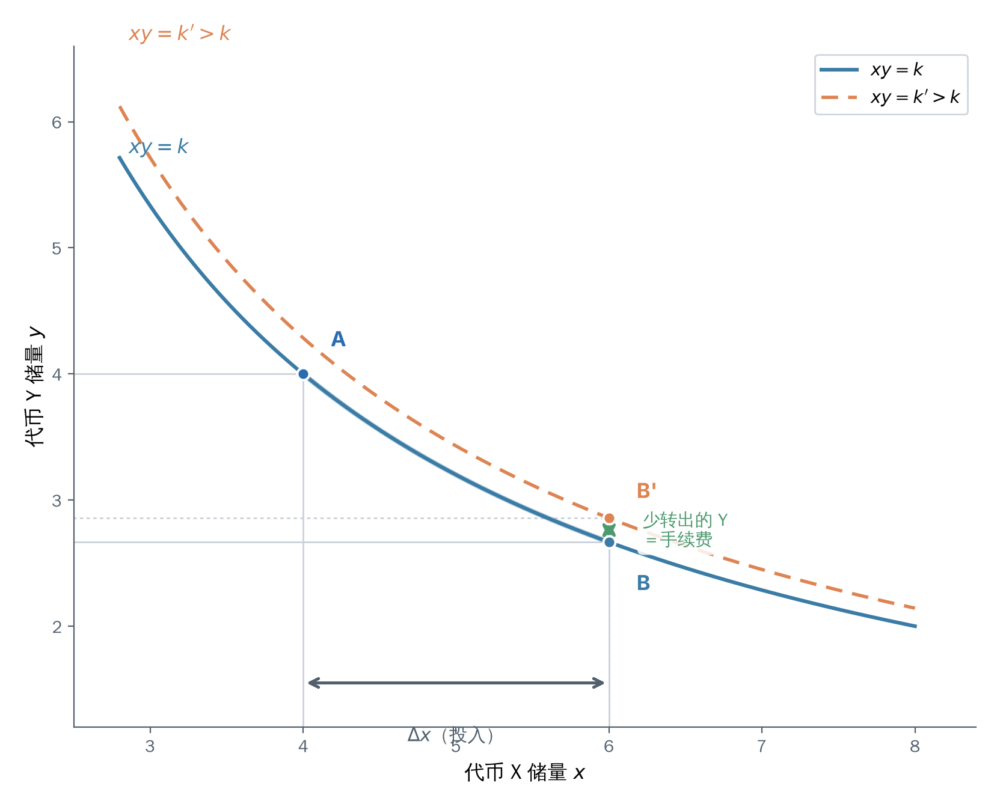

# Fee Mechanism

Chapter 1 derived all the formulas of the constant product market maker under ideal conditions, but in reality price changes bring impermanent loss, causing liquidity providers to bear losses. Therefore, a trading fee must be introduced as an incentive mechanism to compensate for their risk. On top of this, the protocol can optionally enable a protocol fee, taking a portion of the trading fee to reward protocol developers. This chapter focuses on the design principles and mathematical derivations of these two types of fees; their specific contract implementations are left to Chapter 7.

## Trading Fee

Uniswap V2 stipulates that each trade charges a $0.3\%$ fee. Note, however, that this fee is **not** directly deducted as $0.3\%$ from the asset the trader receives. Suppose the trader wants to swap $\Delta x$ of token X for token Y, and the fee rate is denoted $\gamma$ (in reality $\gamma = 0.003$). The fee collection process is then:

1. First deduct $\gamma\Delta x$ from the trader's input $\Delta x$; only the remaining $(1-\gamma)\Delta x$ participates in the constant product calculation.
2. Use $(1-\gamma)\Delta x$ to compute the $\Delta y$ the trader actually receives, according to the constant-product rule.
3. If no fee were charged, the trader would receive more $\Delta y'$ by the swap formula in Chapter 1; the difference $\Delta y' - \Delta y$ is the actual fee paid for this trade.

The key point is: the fee deduction occurs only in the step of "computing the receivable amount." After the trade completes, the token X the trader actually transfers into the pool is still the full $\Delta x$. The token Y that is not transferred out is the true source of the fee.

Let $k$ be the pool's product before the trade. Steps 1 and 2 above written as an equation are:

$$(x + (1-\gamma)\Delta x)(y - \Delta y) = k \tag{1}$$

Solving for $\Delta y$:

$$\Delta y = \frac{(1-\gamma)\Delta x}{x + (1-\gamma)\Delta x}\,y \tag{2}$$

And without a fee, by the swap formula in Chapter 1, the trader would receive:

$$\Delta y' = \frac{\Delta x}{x + \Delta x}\,y \tag{3}$$

Dividing the two equations and simplifying:

$$\frac{\Delta y}{\Delta y'} = 1 - \frac{\gamma x}{x + (1-\gamma)\Delta x} = 1 - \frac{\gamma}{1 + (1-\gamma)\dfrac{\Delta x}{x}} \tag{4}$$

From Equation (4), as long as $\gamma \ne 0$, the ratio is always less than 1, and the missing portion is exactly the fee collected by the pool. For example: let $x = 1000$ and $\Delta x = 1$; substituting into Equation (4) gives $\Delta y / \Delta y' \approx 0.997003$, meaning the trader actually receives about $0.997$ times the fee-free amount, a difference of about $0.003$, nearly identical to the nominal fee rate $\gamma$. Equation (4) also shows that the smaller $\Delta x / x$ (the smaller a single trade is relative to the pool), the closer the ratio is to $1 - \gamma$. This matches intuition: the smaller the trade volume relative to the pool, the smaller the price impact, and the closer the effective fee rate is to the nominal fee rate.

Now let's see where the fee goes. After the trade completes, the product of the pool's reserves is no longer equal to $k$; it has grown a bit:

$$k' = (x + \Delta x)\!\left(y - \frac{(1-\gamma)\Delta x}{x + (1-\gamma)\Delta x}\,y\right) = k\cdot\frac{x + \Delta x}{x + (1-\gamma)\Delta x} > k \tag{5}$$

The reasoning is straightforward: without a fee, the product after the trade would still be $k$; but because of the fee, the $\Delta y$ that should have been transferred out is reduced and stays in the pool, so the product naturally grows. This retained portion is the source of the fee. In other words, **every trade makes the pool's $k$ grow slightly, and the accumulated growth is the fee collectively earned by all LPs**.

*Figure 1　A trade with a fee moves the pool from the curve $xy = k$ to a higher curve $xy = k' > k$. Without a fee, the trade moves along the original curve from A to B; after the fee deduction the trader receives less Y, so the reserve point lands at the higher B', and the extra segment in the vertical direction (green) is the retained fee. For visibility, the fee rate is exaggerated in the figure; V2's actual rate is $0.3\%$.*

Geometrically (Figure 1), a fee-free trade makes the pool's state slide along the curve $xy = k$ from A to B; whereas a trade with a fee, because the trader receives less $\Delta y$, lands the reserve point at B', which is **above** the original curve and corresponds to a higher curve $xy = k'$. The "upward jump" from A to B' is exactly the growth of $k$.

The fee stays in the pool in the form of increased reserves, and when an LP withdraws assets, they withdraw proportionally according to their liquidity share (the remove-liquidity formula from Chapter 1). The share is unchanged, yet the pool has grown, so the LP naturally gets a portion of this growth. This is how LPs earn fees — without any additional bookkeeping.

This conclusion can be expressed rigorously using liquidity. Recall from Chapter 1 that when adding liquidity, the two assets required to contribute $\Delta L$ satisfy $\Delta L = L\,\Delta x / x = L\,\Delta y / y$ (where $L$ is the pool's total liquidity). Taking the geometric mean of both sides:

$$\sqrt{\Delta x_1\,\Delta y_1} = \frac{\Delta L}{L_1}\sqrt{k_1} \tag{6}$$

where $L_1$ and $k_1$ are the total liquidity and product at the time of adding. Similarly, the assets withdrawn when removing liquidity satisfy:

$$\sqrt{\Delta x_2\,\Delta y_2} = \frac{\Delta L}{L_2}\sqrt{k_2} \tag{7}$$

where $L_2$ and $k_2$ are the total liquidity and product at the time of removal. Subtracting the two:

$$\sqrt{\Delta x_2\,\Delta y_2} - \sqrt{\Delta x_1\,\Delta y_1} = \frac{\Delta L}{L_2}\sqrt{k_2} - \frac{\Delta L}{L_1}\sqrt{k_1} \tag{8}$$

The meaning of Equation (8) is: on the scale of the "geometric mean of the two assets' quantities," the net gain (or loss) of the LP during the holding period equals the portion of the pool's product's relative increment allocated to their share. Note that in the transition from $k_1$ to $k_2$ and $L_1$ to $L_2$, various trades and liquidity additions/removals may be interleaved, so the value of Equation (8) is not guaranteed to be positive — this reflects the impermanent loss of Chapter 1 from another angle: losses from price changes may eat into fee revenue.

The reason the geometric mean $\sqrt{\Delta x\,\Delta y}$ rather than a single asset is used to measure is that an LP's returns are reflected in both assets X and Y simultaneously; the geometric mean exactly cancels out the effect of price changes, leaving only the "pool got bigger overall" portion.

## Protocol Fee

By default, all fees go to LPs. On top of this, the protocol can optionally enable a protocol fee: taking a certain proportion of the already-collected fees for the protocol. Treating the protocol as a "special LP," the question becomes: how much should it receive, and how is it realized?

V2 stipulates that the protocol fee is at most $1/6$ of all fees. Since the fee rate is $0.3\%$, its $1/6$ is $0.05\%$ of the trading volume. Let $\phi = 1/6$ denote the protocol fee's proportion of the trading fee.

The protocol fee is not settled on every trade, but rather computed all at once when someone adds or removes liquidity. The design rationale and cost of this _lazy evaluation_ will be elaborated in Chapter 7 in conjunction with the `_mintFee` implementation. Between two settlements, if only trades occur without liquidity changes, the total liquidity $L$ remains constant, i.e., $L_2 = L_1$ in Equation (8), which reduces to:

$$\frac{\Delta L}{L_1}\bigl(\sqrt{k_2} - \sqrt{k_1}\bigr) \tag{9}$$

That is, every LP holding $\Delta L$ receives a fee of $\dfrac{\Delta L}{L_1}\bigl(\sqrt{k_2} - \sqrt{k_1}\bigr)$ during this window. Summing over all LPs ($\sum \Delta L = L_1$), the fee accumulated by the entire pool during this period, on the liquidity scale, equals exactly:

$$\sqrt{k_2} - \sqrt{k_1} \tag{10}$$

This is why the protocol fee measures growth using $\sqrt{k}$ (rather than $k$). Chapter 1 defined liquidity $L = \sqrt{xy} = \sqrt{k}$, and LP Tokens are minted according to liquidity, so $\sqrt{k}$ is on the same scale as LP shares. Only by distributing according to the growth of $\sqrt{k}$ can the protocol's taken share be strictly proportional to the existing LPs' diluted shares. If $k$ (which is the square of $L$) were used instead, the growth would be amplified quadratically, and the protocol would take too much.

The protocol's realization method is to mint $\Delta L$ new LP Tokens to the protocol address, claiming its share of fees by diluting other LPs' shares. Suppose the total supply before minting is $S$; after minting, the protocol's share is $\dfrac{\Delta L}{S + \Delta L}$; and the entire pool's value on the liquidity scale is proportional to $\sqrt{k_2}$, so the value the protocol receives is $\dfrac{\Delta L}{S + \Delta L}\sqrt{k_2}$. Setting this equal to the proportionally-deserved $\phi\bigl(\sqrt{k_2} - \sqrt{k_1}\bigr)$:

$$\frac{\Delta L}{S + \Delta L}\sqrt{k_2} = \phi\bigl(\sqrt{k_2} - \sqrt{k_1}\bigr) \tag{11}$$

Solving this equation for $\Delta L$:

$$\Delta L = \frac{S\bigl(\sqrt{k_2} - \sqrt{k_1}\bigr)}{\bigl(\tfrac{1}{\phi} - 1\bigr)\sqrt{k_2} + \sqrt{k_1}} \tag{12}$$

Substituting $\phi = 1/6$ (so $1/\phi - 1 = 5$):

$$\Delta L = \frac{S\bigl(\sqrt{k_2} - \sqrt{k_1}\bigr)}{5\sqrt{k_2} + \sqrt{k_1}} \tag{13}$$

Equation (13) is the protocol fee minting formula from the Uniswap V2 Whitepaper §5.1 (Equations (24)–(25)). Mapping it to contract terms: $S$ is the LP Token total supply at the time of settlement, $k_2$ is the current `reserve0 * reserve1`, and $k_1$ is the product recorded at the last settlement (stored in the contract as `kLast`). The contract's formulation `liquidity = totalSupply * (rootK - rootKLast) / (5 * rootK + rootKLast)` matches Equation (13) term by term, and the coefficient $5$ in the denominator is precisely the trace left by the $1/6$ sub-fee rate. The complete `_mintFee` implementation is in Chapter 7.

## Summary

Uniswap V2 charges a $0.3\%$ fee on every trade. This fee is not deducted from the received asset; rather, $\gamma\Delta x$ is first subtracted from the input, the output is computed under the constant-product rule, and the token not transferred out is the fee. The retained portion stays in the pool, causing the product to grow from $k$ to $k' > k$; the accumulated growth is the fee revenue that LPs automatically receive by virtue of their shares, with no extra bookkeeping needed. On top of the trading fee, the protocol can optionally enable a protocol fee, taking at most $1/6$ (i.e., $0.05\%$ of trading volume) from the already-collected fees and minting it as LP Tokens to the protocol address. The protocol fee is settled via lazy evaluation and toggled by governance; the specific implementation mechanism is detailed in Chapter 7.
