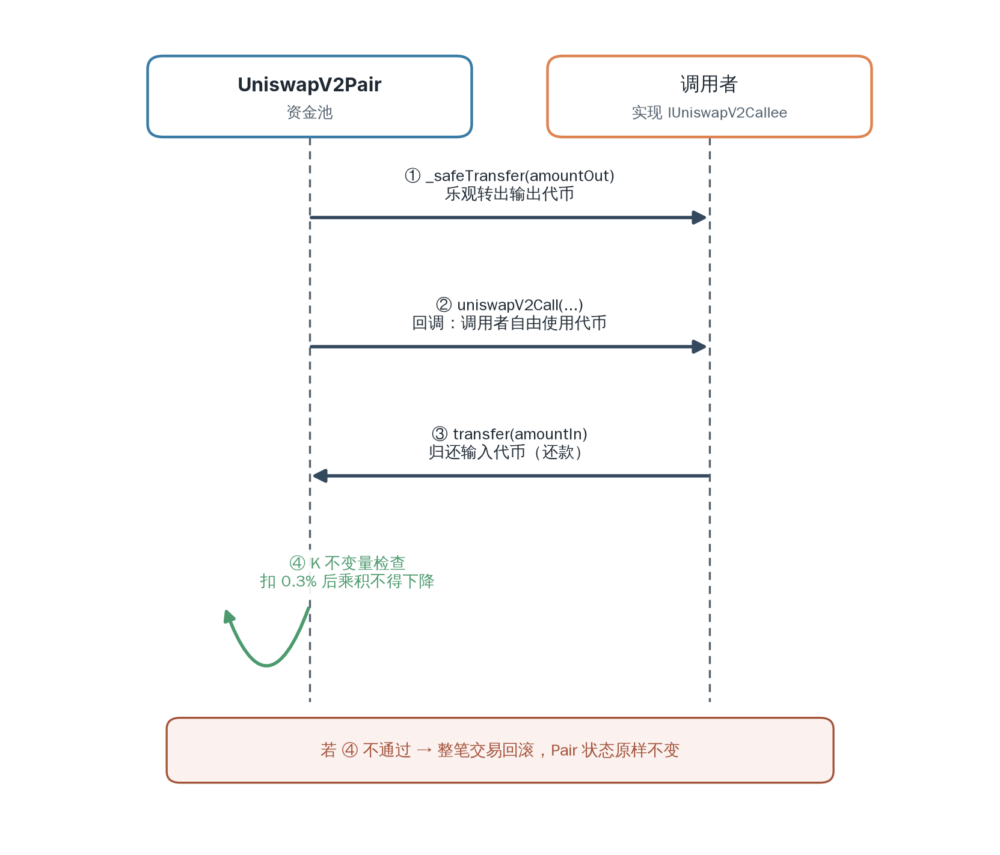

# The Pool

Chapter 3 summarized the core layer as two contracts: the Factory, which creates and registers trading pairs, and each Pair, which is both an AMM pool managing two tokens' reserves and an ERC20 that issues LP Tokens. This chapter dives into the implementation of these two contracts. The first half analyzes how the Factory uses `create2` to deploy each new Pair to a fully predictable address and manages the protocol fee toggle with a minimal governance surface. The second half dissects all of the Pair's mechanisms layer by layer: state recording, adding and removing liquidity, trade execution (including flash swaps), and the `sync` and `skim` functions that handle edge cases where balance and reserves are out of sync. The principles of fees, protocol fees, and oracles were already covered in Chapters 5 and 6; this chapter directly cites their conclusions and focuses on the contract implementation.

## The Factory Contract

The Factory is the "registry" of the entire V2 system, responsible for creating trading pairs and registering their addresses. This section walks through the implementation of `UniswapV2Factory`, seeing how it uses a single line of `create2` to deploy a new Pair to a fully predictable address, why this design lets a Pair's address be computed before it is even created, and how it manages the protocol fee toggle with a minimal governance surface.

### State

The Factory's state is very lean, consisting of only two categories: the trading pair registry, and protocol fee governance.

```solidity
// v2-core/contracts/UniswapV2Factory.sol

address public feeTo;           // protocol fee recipient address; address(0) means disabled
address public feeToSetter;     // account authorized to change feeTo; the only parameter set in the constructor

mapping(address => mapping(address => address)) public getPair;  // trading pair registry, bidirectional
address[] public allPairs;                                        // ordered list of all created Pairs

event PairCreated(address indexed token0, address indexed token1, address pair, uint);
```

`getPair` is a bidirectional mapping: given two token addresses in any order, the corresponding Pair can be looked up directly. `allPairs` preserves the creation order of all Pairs, and its length is the total number of trading pairs in the system (exposed via `allPairsLength`). `feeTo` and `feeToSetter` are for protocol fee governance; see the end of this section.

Note that the Factory has **no** `owner` and **no upgrade mechanism**. Apart from the two fee-related functions, its pair-creation logic cannot be changed once deployed — this embodies the core layer's "minimal, immutable" philosophy (see Chapter 3).

### Creating a Pool

`createPair` is the Factory's core, responsible for turning a pair of tokens into a deployed Pair:

```solidity
function createPair(address tokenA, address tokenB) external returns (address pair) {
    require(tokenA != tokenB, 'UniswapV2: IDENTICAL_ADDRESSES');
    (address token0, address token1) = tokenA < tokenB ? (tokenA, tokenB) : (tokenB, tokenA);
    require(token0 != address(0), 'UniswapV2: ZERO_ADDRESS');
    require(getPair[token0][token1] == address(0), 'UniswapV2: PAIR_EXISTS');

    bytes memory bytecode = type(UniswapV2Pair).creationCode;
    bytes32 salt = keccak256(abi.encodePacked(token0, token1));
    assembly {
        pair := create2(0, add(bytecode, 32), mload(bytecode), salt)
    }
    IUniswapV2Pair(pair).initialize(token0, token1);

    getPair[token0][token1] = pair;
    getPair[token1][token0] = pair;
    allPairs.push(pair);
    emit PairCreated(token0, token1, pair, allPairs.length);
}
```

Its flow can be broken into four steps:

**1. Normalization and validation.** The two token addresses must differ, and neither can be the zero address. More importantly, they are **sorted**: `token0` is the smaller and `token1` is the larger. This way, no matter what order the caller passes them — `(A, B)` or `(B, A)` — the normalized result is always the same `(token0, token1)`, guaranteeing that a given token pair has exactly one Pair globally. The "already exists" check is therefore performed after sorting, and only one direction (`getPair[token0][token1]`) needs to be checked — the comment "single check is sufficient" refers exactly to this.

**2. CREATE2 deployment.** Take the Pair's creation bytecode `type(UniswapV2Pair).creationCode`, use `salt = keccak256(token0 ‖ token1)`, and deploy it via inline assembly `create2`. The four arguments of `create2(0, add(bytecode, 32), mload(bytecode), salt)` are, in order: the transfer amount (0), the in-memory start position of the bytecode (skipping the `bytes` variable's 32-byte length prefix), the bytecode length (read from that prefix), and the salt. `create2` is the EVM's deterministic deployment opcode; the deployed address is determined entirely by the deployer, the salt, and the bytecode.

**3. Initialization.** After deployment, immediately call `IUniswapV2Pair(pair).initialize(token0, token1)` to bind the two token addresses to the new Pair (the `initialize` function, which only allows the Factory to call it, will be analyzed in the Pool section of this chapter).

**4. Registration and event.** Write the new address into both directions of the mapping simultaneously (so that queries in any order hit), push it into `allPairs`, and finally emit `PairCreated`. The event's last parameter is `allPairs.length`, the index of this Pair.

### Deterministic Address

The most valuable property of `create2` is: **the deployed address can be computed before deployment**. The CREATE2 address formula is:

$$\text{address} = \text{keccak256}(\texttt{0xff} \,\|\, \text{deployer} \,\|\, \text{salt} \,\|\, \text{keccak256}(\text{init code}))[-20\text{:}] \tag{1}$$

Here `deployer` is the Factory and `salt` is `keccak256(token0 ‖ token1)`; both are known quantities. What remains is `keccak256(init code)`, which must also be a constant for the entire address to be predictable.

This is precisely the fundamental reason for separating `initialize` from the constructor. The `init code` consists of the contract's creation bytecode concatenated with the **constructor arguments**. If the constructor accepted token addresses as parameters, those parameters would be concatenated into the `init code`, making `keccak256(init code)` vary with the parameters — and thus the address would vary too; it would still be computable, but a separate hash would be needed for each token pair. Uniswap deliberately makes the Pair's constructor **parameterless** (it only records `factory = msg.sender`); token addresses are instead set by a separate `initialize`. As a result, `creationCode` is a fixed constant, and so is its hash:

$$\text{INIT\_CODE\_HASH} = \text{keccak256}(\text{creationCode})$$

$$= \texttt{0x96e8ac4277198ff8b6f785478aa9a39f403cb768dd02cbee326c3e7da348845f} \tag{2}$$

With this constant, anyone can compute a given Pair's address without querying on-chain state. The periphery's `UniswapV2Library.pairFor` does exactly this:

```solidity
// v2-periphery/contracts/libraries/UniswapV2Library.sol

function pairFor(address factory, address tokenA, address tokenB) internal pure returns (address pair) {
    (address token0, address token1) = sortTokens(tokenA, tokenB);
    pair = address(uint(keccak256(abi.encodePacked(
            hex'ff',
            factory,
            keccak256(abi.encodePacked(token0, token1)),
            hex'96e8ac4277198ff8b6f785478aa9a39f403cb768dd02cbee326c3e7da348845f' // init code hash
        ))));
}
```

Note that it is a `pure` function — it makes no external calls at all and computes the address in place purely from formula (1) and constant (2). This means the Router, frontends, and aggregators can all counterfactually derive a Pair's future address before it is **even created**, querying its reserves directly or pre-constructing transactions against that address without first calling the Factory. This is a cornerstone of V2's user experience and composability. A complete analysis of `pairFor` appears in the next chapter on the periphery libraries.

> **Note**
> Constant (2) is the init code hash of the officially-deployed `UniswapV2Pair` on mainnet. It depends on the contract's specific compilation output (version, optimization settings, source code); if the Factory deploys a different compilation artifact, the hash differs, and `pairFor` must use the corresponding value. This is also why a self-built fork must recompute and replace this constant.

### Protocol Fee Governance

The Factory manages the protocol fee toggle with just two functions and one permission:

```solidity
function setFeeTo(address _feeTo) external {
    require(msg.sender == feeToSetter, 'UniswapV2: FORBIDDEN');
    feeTo = _feeTo;
}

function setFeeToSetter(address _feeToSetter) external {
    require(msg.sender == feeToSetter, 'UniswapV2: FORBIDDEN');
    feeToSetter = _feeToSetter;
}
```

`setFeeTo` sets the protocol fee's recipient address; `setFeeToSetter` transfers governance itself. Both allow only the current `feeToSetter` to call them.

Recall from Chapter 5 that the Pair's `_mintFee` uses `feeTo != address(0)` to determine whether the protocol fee is enabled. And the Factory's constructor **only sets `feeToSetter`, never `feeTo`**, so `feeTo` defaults to `address(0)` and the protocol fee is disabled by default. To enable it, `feeToSetter` must explicitly call `setFeeTo` to designate a recipient address. This design leaves the decision of "whether to take a cut for the protocol" entirely to governance, keeping the system completely free for users at launch.

### Immutability

The Factory has no owner, no proxy, no pause switch, and no upgrade path. `feeToSetter` is the only privileged role, and even its power is limited to changing `feeTo` and transferring itself; it **cannot** modify the trading formula, the fee rate, the Pair-creation logic, or any behavior of an already-deployed Pair.

This near-absolute immutability is the price the core layer pays for "trustworthiness" and "reusability" (see Chapter 3). Precisely because any protocol or user can trust that V2's core rules will never change, they dare to entrust funds to these contracts long-term or build periphery layers and third-party applications on top of them. The evolvable parts (the Router, libraries, new versions) all live in the periphery layer and future new contracts; the core solidifies once deployed.

## The Pool Contract

### State

A Pair contract's entire runtime state is concentrated in a group of variables. Let's get to know them; the logic of the subsequent sections all revolves around this state:

```solidity
// v2-core/contracts/UniswapV2Pair.sol

address public factory;             // the Factory that deployed this Pair, fixed to msg.sender in the constructor
address public token0;              // the pair's two tokens, set once by initialize
address public token1;

uint112 private reserve0;           // packed into a single storage slot together with reserve1 and blockTimestampLast
uint112 private reserve1;           // uses single storage slot, accessible via getReserves
uint32  private blockTimestampLast; // uses single storage slot, accessible via getReserves

uint public price0CumulativeLast;   // oracle price accumulators, covered in Chapter 6
uint public price1CumulativeLast;
uint public kLast;                  // reserve0 * reserve1, the value after the last liquidity event; covered below

uint private unlocked = 1;
modifier lock() {
    require(unlocked == 1, 'UniswapV2: LOCKED');
    unlocked = 0;
    _;
    unlocked = 1;
}
```

The first three address variables define this Pair's identity. `factory` points to the factory contract that deployed it, fixed to `msg.sender` in the constructor and never changed afterward; the Pair uses it to look back at the protocol fee's on/off state (`feeTo`). `token0` and `token1` are the two tokens this trading pair manages, written once by the Factory calling `initialize`. They are sorted by numerical address value: `token0` is the smaller address and `token1` is the larger, consistent with the normalization the Factory performs when creating the pair, so that any given pair of tokens has exactly one Pair globally, and the `token0`/`token1` result is consistent regardless of query order.

The most central of these are `reserve0` and `reserve1` — the _reserves_ of the two tokens. Note that `reserve0`, `reserve1`, and `blockTimestampLast` are packed into a single 256-bit storage slot (occupying 112, 112, and 32 bits respectively) to save Gas: they are always read and updated together, so placing them in one slot requires only a single storage access. They are returned all at once to the outside via `getReserves`:

```solidity
function getReserves() public view returns (uint112 _reserve0, uint112 _reserve1, uint32 _blockTimestampLast) {
    _reserve0 = reserve0;
    _reserve1 = reserve1;
    _blockTimestampLast = blockTimestampLast;
}
```

`price0CumulativeLast` and `price1CumulativeLast` are price data continuously accumulated for the oracle; their principles are detailed in Chapter 6. `kLast` records the product of the two tokens' reserves after the most recent liquidity event (i.e., $k$); it is the accounting baseline for protocol fee settlement: each time liquidity is added or removed, the contract compares the current $k$'s growth against `kLast` and mints LP Tokens to the protocol address according to the formula derived in Chapter 5. Its complete working mechanism (including lazy evaluation and zeroing on disable) will be covered below in the "Protocol Fee" subsection in conjunction with the `_mintFee` implementation.

`unlocked` together with the `lock` modifier forms a _reentrancy lock_: it is set to 0 on entering a function and restored to 1 on exit, so that core functions cannot be re-entered mid-execution. Since these functions all follow the pattern of transferring first and settling later, reentrancy protection is indispensable. The principle of reentrancy attacks and the implementation details of the `lock` modifier are covered in the standalone "Reentrancy Lock" subsection below.

### Initialization

Finally, how a Pair comes into being. The constructor is extremely simple, recording only who deployed it:

```solidity
constructor() public {
    factory = msg.sender;
}
```

The two tokens of the trading pair are set by a separate `initialize`, which only the Factory may call once:

```solidity
function initialize(address _token0, address _token1) external {
    require(msg.sender == factory, 'UniswapV2: FORBIDDEN');
    token0 = _token0;
    token1 = _token1;
}
```

Why not pass the token addresses directly in the constructor? Because the Factory deploys the Pair with `CREATE2`, it needs a parameterless constructor to keep the Pair's creation bytecode constant, so that the address can be counterfactually derived. The full meaning of this design was already covered in the Factory section of this chapter. Here we only need to know: after creation, each Pair is bound to a pair of tokens by the Factory calling `initialize`, after which `token0`/`token1` never change.

### Reentrancy Lock

The Pair's core functions all rely on the reentrancy lock for safety. Before analyzing the specific liquidity and trading logic, let's understand this mechanism.

#### The Principle of Reentrancy Attacks

A _reentrancy attack_ is one of the most classic vulnerabilities in smart contracts. When a contract makes an external call before returning and before its internal state has been updated, an attacker exploits this time window to re-enter the contract and trigger unexpected behavior in an inconsistent state. The 2016 The DAO incident lost over $150 million this way, ultimately causing an Ethereum hard fork.

The following is a simplified vulnerable contract, adapted from an Ethereum programming guide:

```solidity
contract EtherStore {
    mapping(address => uint256) balances;

    function depositFunds() public payable {
        balances[msg.sender] += msg.value;
    }

    function withdrawFunds() public {
        uint256 _amt = balances[msg.sender];
        (bool res, ) = msg.sender.call{value: _amt}("");  // transfer first
        require(res);
        balances[msg.sender] -= _amt;                      // deduct balance afterward
    }
}
```

The vulnerability is in `withdrawFunds`: the contract transfers ether to the caller via `call` first, then deducts the balance. If the caller is a malicious contract, its `receive` function is triggered the instant it receives ether; at that point the balance has not yet been deducted, so the attacker can call `withdrawFunds` again, looping until the contract is drained:

```solidity
contract Attack {
    EtherStore etherStore;
    constructor(address _addr) { etherStore = EtherStore(_addr); }

    function attack() public payable {
        etherStore.depositFunds{value: 1 ether}();
        etherStore.withdrawFunds();
    }

    receive() external payable {
        if (address(etherStore).balance >= 1 ether)
            etherStore.withdrawFunds();  // reentrancy: balance not yet deducted
    }
}
```

The root cause is the ordering of external calls and state updates: the contract surrenders control before completing settlement.

#### The Pair's Reentrancy Lock

The Pair faces the same risk. Its core functions `mint`, `burn`, and `swap` all follow the pattern of transferring tokens first and then settling based on the balance difference. `swap` in particular also calls back to an external address's `uniswapV2Call` (flash swap). If an attacker re-enters `mint` or `swap` during the callback, they could profit within the window before reserves are updated.

V2's solution is a minimal mutex lock:

```solidity
uint private unlocked = 1;
modifier lock() {
    require(unlocked == 1, 'UniswapV2: LOCKED');
    unlocked = 0;
    _;
    unlocked = 1;
}
```

`unlocked` starts at 1. Upon entering a `lock`-decorated function, it checks whether the value is 1 and immediately sets it to 0 (locked); after the function body completes, it is restored to 1 (unlocked). If an attacker attempts re-entry mid-execution, `require(unlocked == 1)` reverts because `unlocked` is still 0, and the attack cannot succeed.

All state-changing core functions in the Pair carry the `lock` modifier: `mint`, `burn`, `swap`, `sync`, and `skim`. They share the same lock (the same `unlocked` variable) and are therefore mutually exclusive: while any one core function is executing, none of the others can re-enter, ensuring that at most one core operation is changing state at any given moment.

### Liquidity Management

This section works bottom-up: first how `_update` synchronizes reserves, then the complete logic of `mint` (adding liquidity) and `burn` (removing liquidity) respectively, and finally `_mintFee`, explaining how the protocol fee is realized during liquidity events.

#### Updating Reserves

Before analyzing `mint` and `burn`, we need to understand a foundational function. All operations in the Pair contract that change reserves ultimately go through `_update`:

```solidity
// v2-core/contracts/UniswapV2Pair.sol

function _update(uint balance0, uint balance1, uint112 _reserve0, uint112 _reserve1) private {
    require(balance0 <= uint112(-1) && balance1 <= uint112(-1), 'UniswapV2: OVERFLOW');
    uint32 blockTimestamp = uint32(block.timestamp % 2**32);
    uint32 timeElapsed = blockTimestamp - blockTimestampLast;
    if (timeElapsed > 0 && _reserve0 != 0 && _reserve1 != 0) {
        price0CumulativeLast += uint(UQ112x112.encode(_reserve1).uqdiv(_reserve0)) * timeElapsed;
        price1CumulativeLast += uint(UQ112x112.encode(_reserve0).uqdiv(_reserve1)) * timeElapsed;
    }
    reserve0 = uint112(balance0);
    reserve1 = uint112(balance1);
    blockTimestampLast = blockTimestamp;
    emit Sync(reserve0, reserve1);
}
```

`_update` does two things:

1. **Updates the oracle cumulative prices**: on the first reserve update of each block, it multiplies the current price by the elapsed time and accumulates it into `price0CumulativeLast` and `price1CumulativeLast`. This is the core data source for the oracle, analyzed in detail in Chapter 6.
2. **Synchronizes reserves**: it writes the contract's actual token balances into `reserve0` and `reserve1`.

> **Important**
> The first two parameters of `_update` are `balance0` and `balance1` (the contract's actual token balances), not any computed values. This is a design principle that runs throughout V2: **reserves always reflect the contract's true balance**. `mint`, `burn`, and `swap` are no exception — all of them first transfer tokens in/out of the contract and then overwrite reserves with the true balance.

Also note the overflow check `require(balance0 <= uint112(-1))`. Although the maximum value of `uint112` is about $5.19 \times 10^{33}$, which is large enough for the vast majority of tokens (an 18-decimal token maxes out around $10^{18}$), this check ensures that reserves can be safely written back into the packed storage slot.

#### Adding Liquidity

`mint` handles two cases depending on whether the pool already has liquidity. On the first deposit (`totalSupply == 0`), there are no historical reserves to reference, so liquidity is computed as the geometric mean of the deposited amounts $\sqrt{\Delta x \cdot \Delta y}$, and 1000 units of minimum liquidity are permanently locked to prevent the pool from being drained to a zero price. On subsequent deposits, the existing reserve ratio serves as the baseline, and the new LP Tokens take the smaller of the two candidate values computed for each token, ensuring no excess is minted. Both cases share the same calling convention and balance-difference inference logic.

##### Calling Convention

The `mint` function is the entry point for a liquidity provider to deposit funds into the pool. Chapter 1 derived the mathematical principles of liquidity management; now let's see how they translate into contract code.

The Pair's `mint` follows a special calling convention: **the caller first transfers the tokens to be deposited into the Pair contract, and then calls `mint`**.

```solidity
function mint(address to) external lock returns (uint liquidity) {
    (uint112 _reserve0, uint112 _reserve1,) = getReserves();
    uint balance0 = IERC20(token0).balanceOf(address(this));
    uint balance1 = IERC20(token1).balanceOf(address(this));
    uint amount0 = balance0.sub(_reserve0);
    uint amount1 = balance1.sub(_reserve1);
    // ...
}
```

The contract computes the newly added token quantities by comparing the current balance with the last recorded reserves:

$$\text{amount0} = \text{balance0} - \text{reserve0}$$
$$\text{amount1} = \text{balance1} - \text{reserve1}$$

This is why `mint` does not take token-quantity parameters — the contract infers them from the balance difference itself. This pattern is called an _optimistic transfer_: it first assumes the caller has already transferred the tokens and verifies via the balance difference. It moves the external action of "transferring in" outside the core contract, so the Pair need not trust the amount provided by anyone.

##### First Deposit

When liquidity is added to the pool for the first time (`totalSupply == 0`), liquidity is computed as the geometric mean:

```solidity
if (_totalSupply == 0) {
    liquidity = Math.sqrt(amount0.mul(amount1)).sub(MINIMUM_LIQUIDITY);
    _mint(address(0), MINIMUM_LIQUIDITY);
}
```

Recall the formula from Chapter 1: liquidity $L = \sqrt{xy}$. Here `Math.sqrt(amount0 * amount1)` is exactly $\sqrt{\Delta x \cdot \Delta y}$.

The first deposit also has a special treatment: **permanently locking the minimum liquidity**. `MINIMUM_LIQUIDITY = 10^3 = 1000` LP Tokens are minted to address `0` (i.e., burned), permanently removed from the total supply.

Why is locking the minimum liquidity necessary? Consider an extreme scenario: if the pool's liquidity were entirely removed (`totalSupply` drops to 0), then the next person to add liquidity could set the pool's initial price arbitrarily, because there would be no historical reserve ratio to reference. Locking 1000 LP Tokens ensures that `totalSupply` never drops to 0, guaranteeing the pool always retains a valid reserve ratio as a price reference.

The actual value of 1000 LP Tokens depends on the amount of the first deposit. If the first deposit was worth \$10,000 in tokens, then 1000 LP Tokens are worth approximately $\frac{1000}{\sqrt{10^6}} \times \$10{,}000 \approx \$10$. For most pools, this is a negligible cost.

##### Subsequent Deposits

When the pool already has liquidity, the new LP Tokens are computed based on the token with the **smaller ratio**:

```solidity
} else {
    liquidity = Math.min(
        amount0.mul(_totalSupply) / _reserve0,
        amount1.mul(_totalSupply) / _reserve1
    );
}
```

Recall the liquidity increment formula from Chapter 1: $\Delta L = L \cdot \frac{\Delta x}{x}$. Expanding:

$$\Delta L = \Delta x \cdot \frac{L}{x} = \Delta x \cdot \frac{\text{totalSupply}}{\text{reserve}}$$

Here two candidate values are computed:

- $\Delta x \cdot \frac{\text{totalSupply}}{\text{reserve0}}$
- $\Delta y \cdot \frac{\text{totalSupply}}{\text{reserve1}}$

Ideally (when the two provided tokens are exactly in the current price ratio), these two values should be equal. But in practice, due to token precision, rounding, and other reasons, the provided ratio may deviate slightly from the pool's price. Taking the `min` ensures that no more LP Tokens than rightfully due are created out of thin air; the excess tokens are effectively donated to the pool, benefiting all existing LPs.

##### Full Flow

Putting it all together, the complete flow of `mint` is:

```solidity
function mint(address to) external lock returns (uint liquidity) {
    (uint112 _reserve0, uint112 _reserve1,) = getReserves();
    uint balance0 = IERC20(token0).balanceOf(address(this));
    uint balance1 = IERC20(token1).balanceOf(address(this));
    uint amount0 = balance0.sub(_reserve0);
    uint amount1 = balance1.sub(_reserve1);

    bool feeOn = _mintFee(_reserve0, _reserve1);
    uint _totalSupply = totalSupply;
    if (_totalSupply == 0) {
        liquidity = Math.sqrt(amount0.mul(amount1)).sub(MINIMUM_LIQUIDITY);
        _mint(address(0), MINIMUM_LIQUIDITY);
    } else {
        liquidity = Math.min(amount0.mul(_totalSupply) / _reserve0, amount1.mul(_totalSupply) / _reserve1);
    }
    require(liquidity > 0, 'UniswapV2: INSUFFICIENT_LIQUIDITY_MINTED');
    _mint(to, liquidity);

    _update(balance0, balance1, _reserve0, _reserve1);
    if (feeOn) kLast = uint(reserve0).mul(reserve1);
    emit Mint(msg.sender, amount0, amount1);
}
```

The key ordering within the flow is:

1. Read the old reserves, query the current balance, compute the newly added token quantities.
2. Call `_mintFee` to settle the protocol fee (if enabled); see the "Protocol Fee" subsection below.
3. Based on whether `totalSupply` is zero, compute the number of LP Tokens to mint.
4. Mint LP Tokens to the recipient.
5. Update reserves.
6. If the protocol fee is enabled, record the current $k$ for the next fee calculation.

#### Removing Liquidity: burn

`burn` is the inverse of `mint`: the LP returns LP Tokens and withdraws both tokens proportionally.

```solidity
function burn(address to) external lock returns (uint amount0, uint amount1) {
    (uint112 _reserve0, uint112 _reserve1,) = getReserves();
    address _token0 = token0;
    address _token1 = token1;
    uint balance0 = IERC20(_token0).balanceOf(address(this));
    uint balance1 = IERC20(_token1).balanceOf(address(this));
    uint liquidity = balanceOf[address(this)];

    bool feeOn = _mintFee(_reserve0, _reserve1);
    uint _totalSupply = totalSupply;
    amount0 = liquidity.mul(balance0) / _totalSupply;
    amount1 = liquidity.mul(balance1) / _totalSupply;
    require(amount0 > 0 && amount1 > 0, 'UniswapV2: INSUFFICIENT_LIQUIDITY_BURNED');
    _burn(address(this), liquidity);
    _safeTransfer(_token0, to, amount0);
    _safeTransfer(_token1, to, amount1);
    balance0 = IERC20(_token0).balanceOf(address(this));
    balance1 = IERC20(_token1).balanceOf(address(this));

    _update(balance0, balance1, _reserve0, _reserve1);
    if (feeOn) kLast = uint(reserve0).mul(reserve1);
    emit Burn(msg.sender, amount0, amount1, to);
}
```

##### Calling Convention

Like `mint`, `burn` follows the transfer-first-then-operate convention: the caller first transfers LP Tokens into the Pair contract, then calls `burn`. The contract obtains the quantity of LP Tokens transferred in via `balanceOf[address(this)]`.

##### Proportional Withdrawal

LP Tokens represent a proportional share of the pool. When removing liquidity, the withdrawal of each token is computed by share:

$$\text{amount0} = \text{liquidity} \times \frac{\text{balance0}}{\text{totalSupply}}$$
$$\text{amount1} = \text{liquidity} \times \frac{\text{balance1}}{\text{totalSupply}}$$

Note that `balance` (the actual balance) is used here rather than `reserve` (the recorded reserves). Because fees stay in the pool by increasing the balance, `balance` may be slightly larger than `reserve`. Using `balance` ensures that LPs receive the benefit of accumulated fees — this is exactly the mechanism by which LPs earn trading fees: fees stay in the pool, growing the balance, so that each LP receives more when withdrawing proportionally.

##### Full Flow

1. Read reserves, query token balances, obtain the quantity of LP Tokens transferred in.
2. Call `_mintFee` to settle the protocol fee.
3. Compute the withdrawable quantity of both tokens based on the LP Tokens' share of the total supply.
4. Burn the LP Tokens.
5. Transfer the tokens out to the recipient.
6. Re-query the balances (balances may change after transfers due to transfer fees).
7. Update reserves.

#### Protocol Fee

Before computing LP Tokens, every `mint` or `burn` first calls `_mintFee` to settle the protocol fee accumulated since the last liquidity event. `_mintFee` is the contract implementation of the Chapter 5 protocol fee formula:

```solidity
function _mintFee(uint112 _reserve0, uint112 _reserve1) private returns (bool feeOn) {
    address feeTo = IUniswapV2Factory(factory).feeTo();
    feeOn = feeTo != address(0);
    uint _kLast = kLast; // gas savings
    if (feeOn) {
        uint rootK = Math.sqrt(uint(_reserve0).mul(_reserve1));
        uint rootKLast = Math.sqrt(_kLast);
        if (rootK > rootKLast) {
            uint numerator = totalSupply.mul(rootK.sub(rootKLast));
            uint denominator = rootK.mul(5).add(rootKLast);
            uint liquidity = numerator / denominator;
            if (liquidity > 0) _mint(feeTo, liquidity);
        }
    } else if (_kLast != 0) {
        kLast = 0;
    }
}
```

Its logic can be understood line by line against Chapter 5.

First, it reads the protocol fee recipient address via `IUniswapV2Factory(factory).feeTo()`. `feeOn = feeTo != address(0)` determines whether the protocol fee is enabled: it takes effect only when governance has set a non-zero `feeTo` through the Factory (the protocol fee is disabled by default; see the Factory section of this chapter and Chapter 5).

When `feeOn` is true, the accumulated protocol fee is settled. `rootK` is the current $\sqrt{k}$, and `rootKLast` is the $\sqrt{k}$ recorded at the last settlement (i.e., $\sqrt{\text{kLast}}$). If `rootK > rootKLast`, it means the accumulation of trading fees since the last settlement has grown $k$; the growth $\sqrt{k_2} - \sqrt{k_1}$ is the distributable fee (Chapter 5, Equation (10)). LP Tokens are minted to the `feeTo` address accordingly, in the quantity given by Chapter 5, Equation (13):

$$\text{liquidity} = \frac{\text{totalSupply} \times (\text{rootK} - \text{rootKLast})}{5 \times \text{rootK} + \text{rootKLast}}$$

The numerator is $\text{totalSupply} \times (\sqrt{k_2} - \sqrt{k_1})$, and the denominator is $5\sqrt{k_2} + \sqrt{k_1}$, matching Equation (13) term by term, where the coefficient 5 comes from the protocol fee rate $\phi = 1/6$ (i.e., $1/\phi - 1 = 5$). The protocol shares in the pool's accumulated fees through these newly minted LP Tokens, realizing its share by diluting existing LPs.

The `else if (_kLast != 0)` branch handles the case where the protocol fee is disabled. Once `feeOn` is false while `kLast` is non-zero, it means the protocol fee was just turned off (`feeTo` was set back to the zero address). At this point `kLast` is zeroed, erasing the accounting baseline from before the shutdown. This ensures that even if the protocol fee is re-enabled later, it will not retroactively collect fees from the disabled period; turning it off means the fees from that window are entirely relinquished to LPs.

`_mintFee` returns `feeOn`, and the caller decides whether to refresh `kLast` after settlement based on it. Returning to the end of `mint` and `burn`:

```solidity
if (feeOn) kLast = uint(reserve0).mul(reserve1);
```

When the protocol fee is enabled, the current $k$ is written to `kLast` as the new baseline for the next settlement. This design — not collecting fees on every trade but settling all at once when liquidity is added or removed — is called lazy evaluation.

It relies on a key fact: at the end of each settlement, the accounting baseline is refreshed to the current $k$ (in the contract, `kLast` is updated), and while liquidity events also change $k$, they immediately update the baseline to the new value, effectively zeroing out their own impact. Therefore, between two liquidity events, the only thing that can change $k$ is trading, and the growth $\sqrt{k_2} - \sqrt{k_1}$ seen at the next settlement exactly equals the pure trading fees accumulated during that window — no more, no less.

Lazy evaluation brings three benefits: every trade needs no additional fee computation or minting, keeping the core trading path minimal; the product used as the baseline is updated only at settlement rather than written to storage on every trade; and the fees accumulated over multiple trades are computed all at once, amortizing the precision loss of integer division. The cost is that if no one adds or removes liquidity for a long time, the accumulated protocol fee may be considerable; but since fees are issued as LP Tokens and the minted quantity is strictly bounded by Chapter 5, Equation (13) and never exceeds the rightful share, there is no over-collection security issue — at worst, the protocol simply "forgets" to collect.

### Trading

`swap` is the Pair's core function for executing trades and the most intricate part of V2. Like `mint`/`burn`, it follows the optimistic-transfer approach, but in the opposite direction: **it first transfers the output tokens to the caller, then checks whether enough input tokens were received**.

#### Optimistic Transfer

So far, `swap` has been described in terms of ordinary trades: the input tokens are transferred in before `swap`. But there is a critical line of callback in the code:

```solidity
if (data.length > 0) IUniswapV2Callee(to).uniswapV2Call(msg.sender, amount0Out, amount1Out, data);
```

When the caller passes non-empty `data`, the Pair calls back `uniswapV2Call` on the `to` address **after transferring the output tokens but before the K-invariant check**. This ordering is the foundation of V2's flash swap implementation:



*Figure 1　The execution timing of a flash swap. The Pair first optimistically transfers the output tokens to the caller, then calls back `uniswapV2Call`; within the callback the caller may use these tokens freely (arbitrage, transfer, repayment), and only after the callback returns does the Pair perform the K-invariant check, ensuring the caller has returned enough input tokens.*

Because the callback occurs before the K check, the caller has already "received" the output tokens within `uniswapV2Call` and can do anything with them — arbitrage, move them to another pool, or even use them as a flash loan — as long as, before the callback ends, it returns an equivalent amount (including the 0.3% fee) of input tokens to the Pair so that the subsequent K check passes. This brings two capabilities:

- **Uncollateralized borrowing**: you can borrow one token first, perform operations in the callback, then repay — all within a single transaction, with no collateral required.
- **Multi-hop arbitrage**: you can swap A for B, then within the callback swap B for C, and ultimately repay enough A, compressing an entire arbitrage path into a single `swap`.

If the K check fails after the callback, the entire transaction reverts and the Pair's state is unchanged, so flash swaps are safe for the pool.

```solidity
function swap(uint amount0Out, uint amount1Out, address to, bytes calldata data) external lock {
    require(amount0Out > 0 || amount1Out > 0, 'UniswapV2: INSUFFICIENT_OUTPUT_AMOUNT');
    (uint112 _reserve0, uint112 _reserve1,) = getReserves();
    require(amount0Out < _reserve0 && amount1Out < _reserve1, 'UniswapV2: INSUFFICIENT_LIQUIDITY');

    uint balance0;
    uint balance1;
    {
        address _token0 = token0;
        address _token1 = token1;
        require(to != _token0 && to != _token1, 'UniswapV2: INVALID_TO');
        if (amount0Out > 0) _safeTransfer(_token0, to, amount0Out); // optimistically transfer tokens out first
        if (amount1Out > 0) _safeTransfer(_token1, to, amount1Out); // optimistically transfer tokens out first
        if (data.length > 0) IUniswapV2Callee(to).uniswapV2Call(msg.sender, amount0Out, amount1Out, data);
        balance0 = IERC20(_token0).balanceOf(address(this));
        balance1 = IERC20(_token1).balanceOf(address(this));
    }
    // ...then check whether the input is sufficient (see below)
```

The caller (usually the Router) has already transferred the input tokens to be paid into the Pair before calling `swap`. So when `swap` begins executing, the Pair's balance contains both the original reserves and this input. `swap` directly transfers `amount0Out`/`amount1Out` of output tokens to `to`, then checks the rest.

Note that at least one of `amount0Out` and `amount1Out` must be greater than 0, but they cannot both be in the input direction; which token swaps for which is entirely specified by the caller through these two parameters, and the contract itself does not care about direction.

#### Inferring the Actual Input

After transferring the output tokens, the contract re-reads the balances and infers how much input was actually received:

```solidity
uint amount0In = balance0 > _reserve0 - amount0Out ? balance0 - (_reserve0 - amount0Out) : 0;
uint amount1In = balance1 > _reserve1 - amount1Out ? balance1 - (_reserve1 - amount1Out) : 0;
require(amount0In > 0 || amount1In > 0, 'UniswapV2: INSUFFICIENT_INPUT_AMOUNT');
```

Taking token0 as an example: if no token0 input was received at all, the balance after transferring out `amount0Out` should be exactly `_reserve0 - amount0Out`. Therefore, the amount exceeding this value is the actual token0 input received, `amount0In`. In an ordinary trade, the token swapped in has `amountIn > 0`, and the token swapped out has `amountIn == 0`.

#### The K-Invariant Check

The most critical step is verifying that the trade did not make the pool "shrink." V2 uses an elegant integer formulation:

```solidity
uint balance0Adjusted = balance0.mul(1000).sub(amount0In.mul(3));
uint balance1Adjusted = balance1.mul(1000).sub(amount1In.mul(3));
require(balance0Adjusted.mul(balance1Adjusted) >= uint(_reserve0).mul(_reserve1).mul(1000**2), 'UniswapV2: K');
```

Here `.mul(1000).sub(amount0In.mul(3))` is equivalent to deducting a $\frac{3}{1000} = 0.3\%$ fee from the input. Expanding the check condition gives:

$$(1000 \cdot \text{balance0} - 3 \cdot \text{amount0In})(1000 \cdot \text{balance1} - 3 \cdot \text{amount1In}) \ge 1000^2 \cdot \text{reserve0} \cdot \text{reserve1} \tag{3}$$

Dividing both sides by $1000^2$ and substituting $\text{balance} \approx \text{reserve} + \text{amountIn} - \text{amountOut}$, its meaning is exactly the fee-bearing form of Chapter 1, Equation (2):

$$(x + 0.997 \cdot \Delta x)(y - \Delta y) \ge x \cdot y \tag{4}$$

That is, after deducting the 0.3% fee, the pool's product $k$ is not allowed to decrease; the excess is the fee retained in the pool, owned by all LPs (the `burn` in the previous section extracts using `balance` rather than `reserve` precisely so that LPs receive this portion).

This on-chain check and the off-chain estimate given by the periphery library `UniswapV2Library.getAmountOut` are two formulations of the same formula. The latter writes the 0.3% as $\frac{997}{1000}$:

$$\text{amountOut} = \frac{997 \cdot \text{amountIn} \cdot \text{reserveOut}}{1000 \cdot \text{reserveIn} + 997 \cdot \text{amountIn}} \tag{5}$$

The Router uses it off-chain to compute the expected output and apply slippage protection, while the on-chain `swap` uses Equation (3) as a backstop, ensuring the actual result is no worse than the boundary allowed by this formula.

#### Full Flow

The complete ordering of `swap` can be summarized as:

1. Validate that the output amount is non-zero and does not exceed reserves.
2. **Optimistically transfer** the output tokens to `to`.
3. If `data` is non-empty, call back `to`'s `uniswapV2Call` (the flash swap entry point).
4. Re-read the balances and infer the actual input `amount0in`/`amount1In`.
5. **K-invariant check**: after deducting the 0.3% fee, the product must not decrease.
6. `_update` synchronizes reserves and accumulates oracle prices, emitting `Swap`.

Notably, the entire `swap` takes no explicit "input amount" parameter — the input is inferred from the balance difference; nor does it fix a swap direction, which is determined by the non-zero entry of `amount0Out`/`amount1Out`. This "look only at the result, not the process" design is precisely what makes flash swaps possible.

### sync() and skim()

`sync` and `skim` are two utility functions the Pair provides for handling special situations where reserves and actual balances are out of sync.

#### sync: Synchronize Reserves to Balance

```solidity
function sync() external lock {
    _update(
        IERC20(token0).balanceOf(address(this)),
        IERC20(token1).balanceOf(address(this)),
        reserve0,
        reserve1
    );
}
```

`sync` forcibly updates the reserves to the current actual balances. This is useful in the following scenarios:

- **Fee-on-transfer tokens**: some tokens deduct a portion on every transfer. When a user transfers such tokens into the Pair, the amount actually received is less than the amount transferred, causing a mismatch between balance and reserves. Calling `sync` can correct this discrepancy.
- **Accidental transfers**: if someone mistakenly transfers tokens directly into the Pair contract (not through `mint`), these tokens are not recorded in reserves. `sync` can fold these ownerless tokens into reserves, benefiting all LPs.
- **Reserve repair**: whenever a balance-reserve mismatch occurs for any reason, `sync` is the most direct remedy.

#### skim: Extract Balance Overflow

```solidity
function skim(address to) external lock {
    address _token0 = token0;
    address _token1 = token1;
    _safeTransfer(_token0, to, IERC20(_token0).balanceOf(address(this)).sub(reserve0));
    _safeTransfer(_token1, to, IERC20(_token1).balanceOf(address(this)).sub(reserve1));
}
```

`skim` is the inverse of `sync`: it extracts the portion of the actual balance that exceeds the reserves. It transfers the `balance - reserve` difference to the specified address.

The primary use of `skim` is **to clear excess balances before calling `mint` or `swap`.** Because `mint`/`swap` infer the newly added or input token quantities from the balance difference, if the contract already holds "excess" tokens (e.g., from a prior accidental transfer), those tokens would be erroneously counted. Calling `skim` first to clear the excess balance, then `mint`/`swap`, ensures correct behavior.

Another use is to extract accidentally transferred tokens. If someone mistakenly transfers tokens directly into the Pair contract, anyone can call `skim` to extract them, since `skim` only extracts the portion exceeding reserves and does not affect normal liquidity.

#### The Complementary Relationship of sync and skim

| Operation | When balance > reserves | Effect |
|------|----------------------|------|
| `sync` | Folds the excess into reserves | Excess tokens go to all LPs |
| `skim` | Extracts the excess to a specified address | Excess tokens go to the caller |

Both are means of re-synchronizing reserves with balance; the difference is who gets the excess. `sync` donates the excess to all LPs (by increasing reserves), while `skim` allows anyone to take the excess.

## Summary

This chapter dove into the two major contracts of the core layer. The Factory manages the creation of trading pairs and the protocol fee toggle with minimal state: the bidirectional `getPair` mapping and the `allPairs` list form the trading pair registry, and `feeTo`/`feeToSetter` manage protocol fee governance; the contract has no `owner` and no upgrade mechanism. `createPair` first sorts the tokens, performs the dedup check, then deploys the Pair with `create2` (salt `keccak256(token0 ‖ token1)`) and registers it bidirectionally; the separation of the parameterless constructor from `initialize` makes the `creationCode` hash a constant, by which anyone can counterfactually compute a Pair's address via `pairFor`. The Factory can barely be altered by anyone — the determinism of its core rules is the very foundation of its role as a trustworthy base layer.

The Pair's reserves and timestamp are packed into a single storage slot, and all reserve-changing operations ultimately go through `_update`. When adding liquidity, the first deposit computes $\sqrt{\Delta x \cdot \Delta y}$ and locks 1000 units of minimum liquidity, while subsequent deposits take the smaller of the liquidity computed for each token; when removing liquidity, the LP returns LP Tokens and withdraws tokens proportionally by balance share. `swap` first optimistically transfers out the output tokens, then infers the actual input from the balance difference, and finally uses the K-invariant check after the 0.3% fee deduction as a backstop; between the transfer and the check it calls back `uniswapV2Call`, enabling flash swaps that can borrow and repay within the same transaction. `sync` and `skim` handle the edge cases of reserve-balance desynchronization. With the two major core-layer contracts fully analyzed, the next chapter moves on to the periphery layer.
