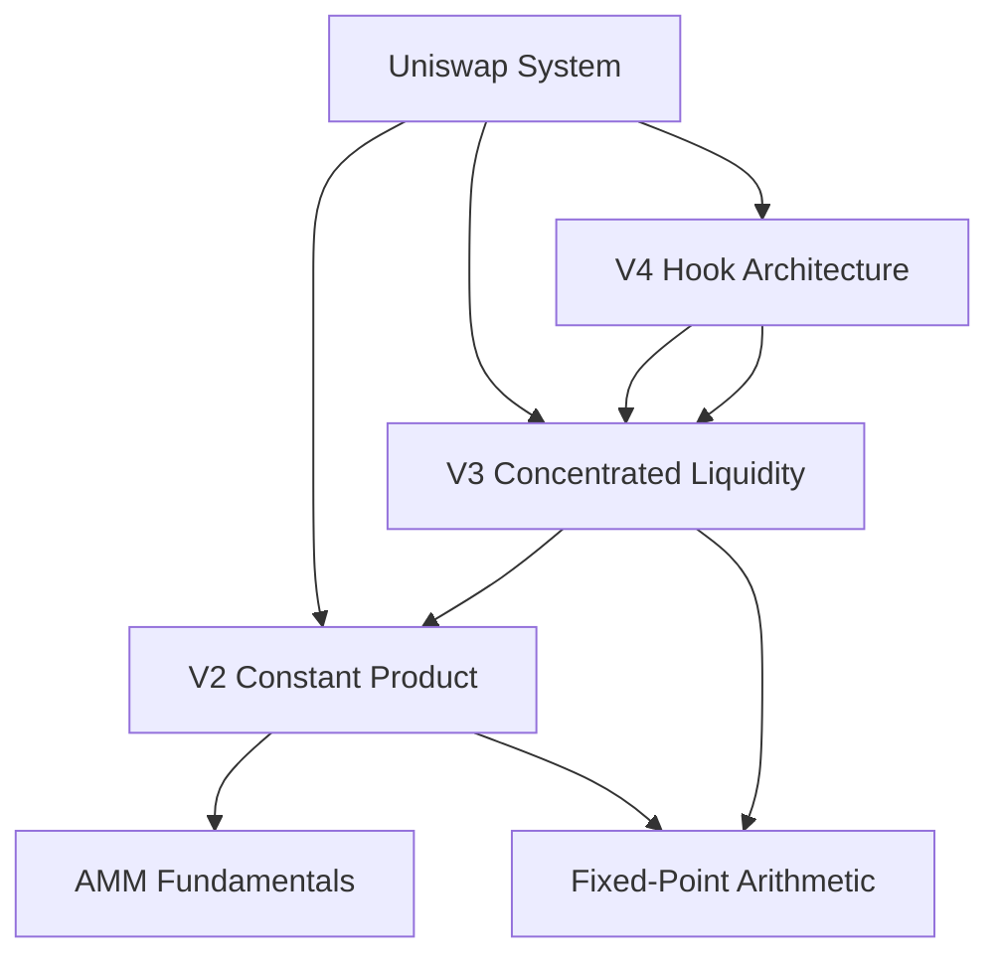

# Preface

## Motivation and Background

The "DeFi Summer" of June 2020 brought decentralized finance (DeFi) into the mainstream spotlight. Among this wave, Uniswap was undoubtedly one of the brightest stars — starting from a simple token swap protocol, it gradually evolved into one of the most important pieces of infrastructure in the DeFi ecosystem. As of this writing, Uniswap's cumulative trading volume has exceeded $2 trillion, making it the decentralized application with the highest trading volume on Ethereum.

In my research on various DeFi protocols, I have come to deeply appreciate that **understanding the design and implementation of underlying protocols is the cornerstone of building higher-level applications**. Without a solid grasp of the core mechanisms of DEXs (decentralized exchanges) — such as constant product market makers, concentrated liquidity, and price oracles — developing arbitrage bots, designing liquidity strategies, or assessing protocol risk is simply impossible.

Online resources about Uniswap are abundant, but they tend to fall into two extremes: one type introduces how to use the Uniswap interface to buy and sell tokens from a user's perspective; the other assumes the reader already possesses prerequisite knowledge such as AMM theory, fixed-point arithmetic, and advanced Solidity features, diving directly into dissecting every function in the contract source code — which is not friendly enough for beginners.

This book aims to find a balance between theory and practice — thoroughly explaining core design principles and their evolution from a design perspective, while also diving deep into contract source code to show how designs are translated into Solidity implementations.

My goal is that after reading this book, readers will have a deep understanding of Uniswap's design principles and implementation details from V1 to V4. If Uniswap's code were to suddenly disappear one day, we would still be able to design and build a complete decentralized trading system from scratch — at least knowing theoretically how to implement it.

## Target Audience

This book is primarily intended for two types of readers:

**The most suitable readers**: Those with some background in blockchain and Solidity. They understand basic smart contract concepts (such as state variables, functions, events) and can read simple Solidity code. If they have also studied data structures (such as trees, bitmaps) and basic algorithms, they can follow this book without any barriers.

**Readers who can also benefit**: People who are already using Web3 applications (such as trading on Uniswap, providing liquidity) and want to understand the underlying mechanisms and principles. This book's content is as self-contained as possible, and most readers should be able to keep up. When encountering unfamiliar concepts, AI tools can help quickly fill in the gaps.

> **About Programming Languages**
> Uniswap's core contracts are written in Solidity. This book provides line-by-line annotations of key code, so even readers with weak Solidity foundations can understand the design intent and implementation logic.

## How to Use This Book

This book can serve as both a systematic read-through and a reference manual for on-demand lookup.

### Progressive Explanation

Uniswap's design embodies profound mathematical and economic ideas (such as constant product market makers, impermanent loss, concentrated liquidity), while also making numerous ingenious engineering optimizations within the constrained environment of Solidity (such as fixed-point arithmetic, bitmap indexing, transient storage).

To help readers better grasp each core concept, we adopt the following structure:

1. **Define the Problem**: First identify the core requirements to be addressed or the key problems to be solved
2. **Analyze Limitations**: Explain why conventional approaches cannot meet the requirements
3. **Deconstruct the Design**: Introduce how Uniswap's design specifically addresses these problems
4. **Implementation Details**: Dive into contract source code to show how the design is concretely implemented in code
5. **Version Evolution**: Trace how the same concept evolves and improves across different versions

Taking Uniswap V3's concentrated liquidity as an example, we proceed as follows:

1. In V2, LP funds are uniformly distributed across the $[0, \infty)$ price range, leaving most funds idle and resulting in low capital efficiency
2. If LPs could specify price ranges for providing liquidity, funds could be concentrated in price ranges more likely to be traded
3. Introduce the Tick concept to discretize the continuous price space, allowing LPs to provide liquidity in any Tick interval
4. Analyze the implementation of data structures like TickBitmap and Position in V3 contracts, and the main swap loop
5. V4 further extends liquidity customization capabilities through the Hook system

Through this approach, readers understand not only "how the code is written" but also "why it was designed this way" and "what improvements each version made."

### DAG-Based Knowledge Construction

Uniswap's knowledge system can be decomposed into layers. The bottom layer consists of independent mathematical tools (such as fixed-point arithmetic, AMM theory); the middle layer comprises core mechanisms (such as the constant product, oracle, flash swap); and the top layer features architectural designs (such as the Factory-Pair pattern, Hook system).

This book adopts a **Directed Acyclic Graph (DAG)** approach to knowledge organization:

- **Bottom-up, layer by layer**: Master AMM theory and fixed-point arithmetic first, then learn V2's constant product implementation; after understanding V2, dive into V3's concentrated liquidity; finally, study V4's Hook architecture
- **Avoid circular dependencies**: Each concept is explained only after its prerequisite knowledge has been covered in previous chapters
- **Minimize cognitive load**: Like building a house — prepare the foundation and bricks first, then use these materials to construct the structure

### Version Cross-Referencing

Uniswap has undergone several major upgrades from V1 in 2018 to V4 in 2024. Implementation differences of the same concept across versions often best reflect the evolution of design thinking. Therefore, this book traces the trajectory of each core concept through V2 → V3 → V4. For example:

- **Oracle**: V2 external cumulative prices → V3 built-in TWAP Oracle → V4 inherits V3 architecture
- **Fees**: V2 fixed 0.3% → V3 multiple fee tiers → V4 dynamic fees + Hook override
- **Token Representation**: V2 fungible LP Token (ERC20) → V3 non-fungible positions (ERC721) → V4 ERC-6909 multi-token

## Book Structure

This book unfolds bottom-up through the following layers:

- **Part I Foundation**: AMM fundamentals, fixed-point arithmetic, etc.
- **Part II Uniswap V2**: Complete implementation of the constant product market maker
- **Part III Uniswap V3**: Concentrated liquidity, Tick mathematics, NFT positions
- **Part IV Uniswap V4**: Hook architecture, flash accounting, dynamic fees
- **Part V Version Evolution**: Architecture and design comparison across three versions

Although Uniswap is a "decentralized exchange," its design philosophy extends far beyond trading itself. From AMM theory to concentrated liquidity, from the Factory-Pair pattern to singleton contracts, from fixed fees to Hook-driven dynamic fees — each upgrade reflects deep thinking about decentralized financial infrastructure.

## Source Code Versions

Uniswap's contracts have undergone several major upgrades, with significant code differences between versions. To avoid version confusion, all code examples and analysis in this book are based on the following specific versions:

| Repository | Version / Commit |
|------|--------------|
| [Uniswap/v2-core](https://github.com/Uniswap/v2-core) | commit `ee547b1` |
| [Uniswap/v2-periphery](https://github.com/Uniswap/v2-periphery) | commit `0335e8f` |
| [Uniswap/v3-core](https://github.com/Uniswap/v3-core) | commit `d8b1c63` |
| [Uniswap/v3-periphery](https://github.com/Uniswap/v3-periphery) | commit `0682387` |
| [Uniswap/v4-core](https://github.com/Uniswap/v4-core) | commit `59d3ecf5` (v4.0.0) |

Locking versions ensures that code examples, function signatures, and implementation logic in this book remain consistent with the descriptions. Readers reading the source code locally are advised to check out the above commits for the best reading experience.

## Conventions

This book uses the following typographical conventions:

- *Italic*: Indicates new terms, URLs, or filenames
- `Monospace`: Indicates code, function names, variable names, or Solidity expressions
- **Bold**: Indicates emphasis or important concepts

> **Tip**
> Paragraphs in this format provide supplementary notes or practical tips.

> **Note**
> Paragraphs in this format highlight important points that require special attention.

> **Warning**
> Paragraphs in this format alert readers to potential pitfalls or risks.
