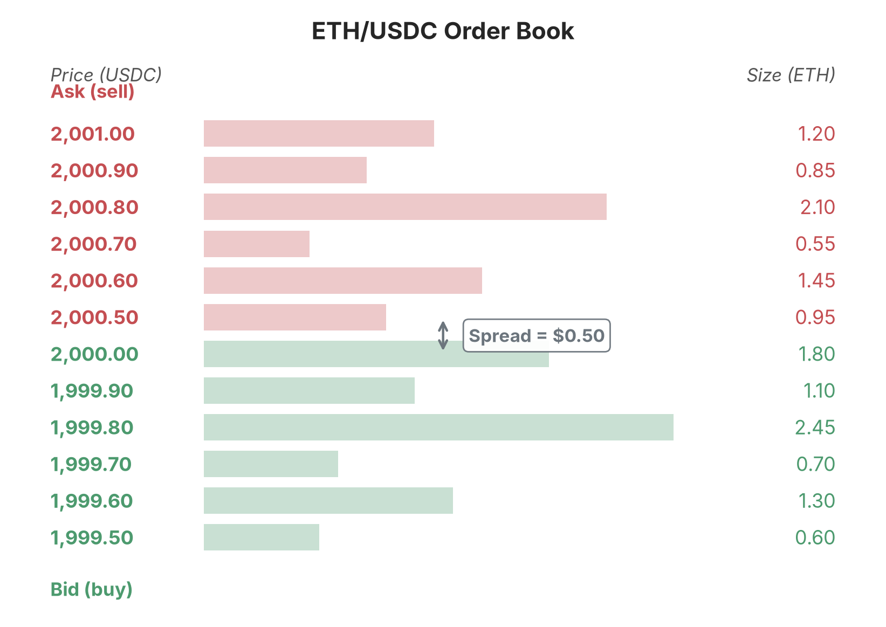
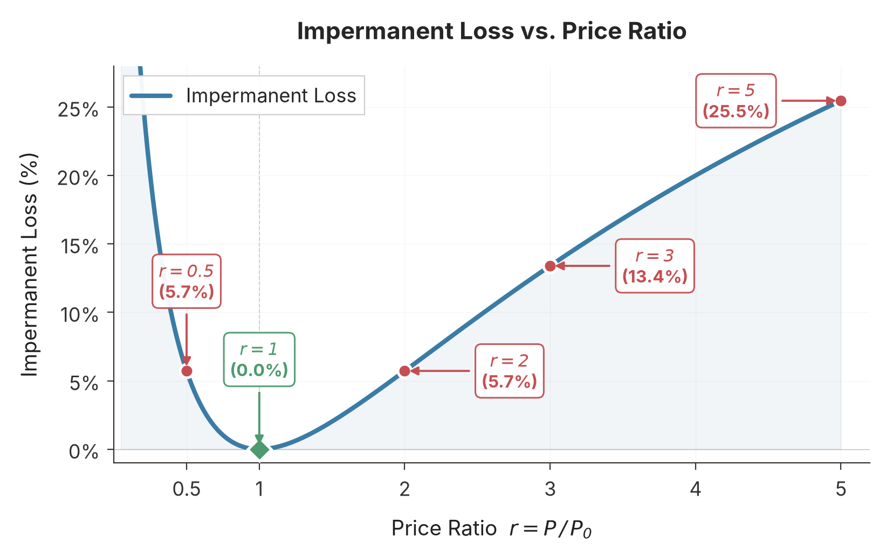

# 恒定乘积自动做市商

由于区块链交易的特点，_中心化交易所（Centralized Exchange, CEX）_ 普遍使用的 _订单簿（Order book）_ 模型在链上环境不再适用，_去中心化交易所（Decentralized Exchange, DEX）_ 需要探索一套适用于区块链的交易模型。Uniswap 采用了 _恒定乘积自动做市商（Constant Product Market Maker, CPMM）_ 模型。本章讨论 CPMM 的相关理论，为后续章节深入 Uniswap 的合约实现奠定基础。

## 背景与动机

在金融市场中，_做市商（Market Maker）_ 是指持续为某种资产提供 _流动性（Liquidity）_ 的机构或个人。所谓流动性，是指一种资产能以合理价格快速买卖的能力。流动性好的市场，交易者可以随时以接近当前市价的价格完成交易，且交易量大时价格冲击小；流动性差的市场，交易者可能需要等待很长时间才能找到对手方，或者被迫接受远偏离市价的价格。

中心化交易所普遍采用订单簿模型，做市商和普通交易者都通过订单簿申报交易。订单簿记录了所有未成交的买单和卖单，_买单（Bid）_ 表示买家愿意以特定价格购买一定数量的资产，_卖单（Ask）_ 表示卖家愿意以特定价格出售一定数量的资产，当买单价格 ≥ 卖单价格时，交易所会自动匹配成交。交易所会向全市场实时推送最新未成交订单消息。图 1 为 ETH/USDC 交易对订单簿的一个示意。

_图 1　ETH/USDC 交易对的订单簿（示意）。上方为卖单（Ask），以红色标识；下方为买单（Bid），以绿色标识；左侧为报价（以 USDC 计），右侧为挂单数量（以 ETH 计）。卖单的最低价与买单的最高价之间的差额即买卖价差（Spread），做市商正是通过在买卖两侧持续挂单、赚取这一价差来提供流动性，这一价差即是市场对其的奖励。_

有了做市商，交易者不需要等待对手方出现，可以随时与做市商交易。正因有利可图，一个市场通常存在多家做市商互相竞争，竞争推动买卖价差收窄，且做市商通过持续报价吸收买卖压力，减少价格的剧烈波动，有利于市场稳定。

因为中心化交易所或者券商提供统一的 API 服务，申报订单的成本几乎可以忽略，因此订单簿模型在中心化交易所（如币安、Coinbase）中运行良好，但在区块链这种去中心化环境中却难以应用，主要原因是一方面交易成本高，每笔挂单、撤单、撮合意味着区块链状态的改变，都需发起链上交易，因此需支付 Gas 费用。特别对做市商，他们通常需要频繁调整报价，在链上执行这种操作的成本几乎无法接受；另一方面是执行速度慢，区块确认时间（例如以太坊约 12 秒）远慢于中心化交易所（微秒级），做市商无法及时响应市场变化。为此，去中心化交易所探索并发展了 _自动做市商（Automated Market Maker, AMM）_ 机制。

自动做市商没有订单簿，取而代之的是 _资金池（Pool）_，资金池存放两种用于互换的资产（如 ETH 和 USDC）。没有了订单簿，资产的交易价格不是由未成交的买单或者卖单决定，而是由资金池中两种资产的储量和一个数学公式决定。做市商也不再通过挂买卖订单做市，而是向资金池同时存入两种资产，为资金池内的资产交易提供流动性，因此也叫做 _流动性提供者（Liquidity Provider, LP）_，其做市奖励不再是低买高卖带来的买卖价差，而是做市机制规定的其他奖励（例如交易手续费、流动性挖矿收益等）。

自动做市商有多种不同的模型，不同的模型定义了不同的价格曲线和流动性分布特征，适用于不同的交易场景。Uniswap 采用的是恒定乘积做市商模型。这个模型因其简洁的数学形式、良好的价格发现特性和对任意代币对的通用性，成为采用最广泛的 AMM 模型。Uniswap 作为最成功的 DEX 协议，正是以 CPMM 为基础构建的。

## 定义

假设一个资金池中包含两种代币 X 和 Y，数量分别为 $x$ 和 $y$。恒定乘积公式规定：

$$x \cdot y = k \tag{1}$$

其中 $k$ 是一个常数。我们把池中代币 X 和 Y 的数量 $x$ 和 $y$ 称为 _储备量（Reserve）_；用户向资金池投入一种代币以换取另一种代币的操作称为 _交易（Swap）_；而在交易过程中始终保持不变的 $k = x \cdot y$，称为 _乘积不变量（Invariant）_。在此基础上，还可以定义两个衡量池子状态的量：以 $L = \sqrt{xy} = \sqrt{k}$ 衡量池中资金的总规模，称为流动性；以 $P = y/x$ 表示代币 X 相对于代币 Y 的 _价格（Price）_，即每 1 个 X 兑换多少 Y。

在以 $x$ 和 $y$ 为坐标轴的平面上，$x \cdot y = k$ 是一条双曲线，如图 2 所示。

_图 2　恒定乘积曲线 $x \cdot y = k$。曲线上任意一点的横、纵坐标之积恒等于常数 $k$；一次交易（Swap）使资金池的状态从点 A 沿曲线移动到点 B，在投入 $\Delta x$ 的同时输出 $\Delta y$，而两者的乘积始终保持不变。_

## 交易

对 CPMM 模型而言，交易时的核心约束是：

> 交易不改变资产流动性，即交易前后，资产储备量的乘积 $k$ 为定值。

假设用户想用 $\Delta x$ 数量的代币 X 换取代币 Y。交易完成后，池中的代币 X 数量变为 $x + \Delta x$，而代币 Y 的数量需要减少 $\Delta y$。根据恒定乘积约束：

$$(x + \Delta x)(y - \Delta y) = k = x \cdot y \tag{2}$$

经过一定的代数运算可得：

$$\Delta y = \frac{\Delta x \cdot y}{x + \Delta x} \tag{3}$$

同理，若用户想用 $\Delta y$ 数量的代币 Y 换取代币 X，则有

$$\Delta x = \frac{\Delta y \cdot x}{y + \Delta y} \tag{4}$$

这就是 CPMM 的核心交易公式：可换取的代币数量完全由输入量与池中的储备量决定。当用一种代币换取另一种代币时，被换取的代币需求增加，其价格随之上升。以代币 Y 换取代币 X 为例，X 的原价格为 $P = y/x$，交易后变为

$$P' = \frac{y + \Delta y}{x - \Delta x} > P \tag{5}$$

表明 X 的价格上升（同理 Y 的价格下降）。这一性质符合供需原理：资产需求增大则价格上升，反之则下降。

由于代币交换数量仅与输入量和池中的储备量相关，而储备量与价格和流动性之间存在关系：

$$\sqrt{xy} = L \tag{6}$$

$$P = y/x \tag{7}$$

因此也可以将交换量 $\Delta x$ 或 $\Delta y$ 表示为流动性和价格的函数：

$$\Delta x = \frac{\Delta L}{\sqrt{P}}, \quad \Delta y = \Delta L\sqrt{P} \tag{8}$$

## 流动性管理

为了保证资金池中有足够的代币进行交换，流动性提供者需向资金池中添加资产，这个过程被称为 _添加流动性（Add Liquidity）_；反之，若流动性提供者想减少资金池中的资产，需要从资金池中移除资产，这个过程被称为 _移除流动性（Remove Liquidity）_。无论是添加还是移除流动性，均涉及两种资产的数量变化，这个变化不是任意的，其核心约束是：

> 添加/移除流动性不改变资产当前价格。

### 添加流动性

设当前池中有 $x$ 个代币 X 和 $y$ 个代币 Y，价格为 $P = y/x$，流动性为 $L = \sqrt{xy}$。LP 要添加 $\Delta x$ 个代币 X 和 $\Delta y$ 个代币 Y。根据核心约束，添加流动性前后价格必须相等：

$$\frac{y}{x} = \frac{y + \Delta y}{x + \Delta x} = P \tag{9}$$

将公式 (9) 略作变形，解得下面的关系式：

$$\frac{\Delta y}{\Delta x} = \frac{y}{x} = P \tag{10}$$

即 $\Delta y = \Delta x \cdot P$。LP 提供的两种代币数量不能随意选择，必须严格遵循当前价格的比例。

公式 (10) 说明，当资产已有储量，添加流动性时，提供的两种资产的量必须成比例，且比值就是当前价格。根据这个约束关系式即确定 $\Delta x$ 和 $\Delta y$ 的数量，既然两者数量已确定，那么其乘积为常数，设：

$$\Delta x \Delta y = (\Delta L)^2 \tag{11}$$

联立公式 (10) 和 (11)，我们可以写出：

$$\Delta L = \Delta x\sqrt{P} = \Delta x\sqrt{\frac{y}{x}} = \Delta x\sqrt{\frac{xy}{x^2}} = L\frac{\Delta x}{x} \tag{12}$$

同理可得：

$$\Delta L = \frac{\Delta y}{\sqrt{P}} = \frac{\Delta y}{\sqrt{\frac{y}{x}}} = \frac{\Delta y}{\sqrt{\frac{y^2}{xy}}} = L\frac{\Delta y}{y} \tag{13}$$

结合公式 (12) 和 (13)，LP 添加资产后，新的流动性 $L'$ 满足：

$$L'^2 = (x + \Delta x)(y + \Delta y) = (L + \Delta L)^2 \tag{14}$$

公式 (14) 说明 $\Delta L$ 可以看作流动性增量，也就是 LP 在原来的流动性基础上，向资金池注入了 $\Delta L$ 的流动性。

### 移除流动性

添加流动性时，$\Delta x$ 和 $\Delta y$ 均大于 0；移除流动性是添加流动性的逆操作，此时 $\Delta x$、$\Delta y$（以及 $\Delta L$）均小于 0。根据核心约束，移除流动性同样不改变价格，故公式 (9) 仍然成立；由添加流动性的公式 (12)、(13) 反解，可得 LP 移除流动性时取回的储量：

$$\Delta x = \frac{\Delta L}{L} \cdot x \tag{15}$$

$$\Delta y = \frac{\Delta L}{L} \cdot y \tag{16}$$

其中 $x$、$y$ 是移除时池中的代币储量。

或者表示为 $P$ 和 $L$ 的关系式：

$$\Delta x = \frac{\Delta L}{\sqrt{P}} \tag{17}$$

$$\Delta y = \Delta L\sqrt{P} \tag{18}$$

公式 (15) 和 (16) 表明 LP 按其持有的流动性份额比例取回两种代币。

需要注意的是，LP 在存入和取回流动性期间，池中代币的数量可能因交易而发生了变化，取回的 $\Delta x$ 和 $\Delta y$ 与最初添加流动性时提供的数量往往不会相等。

## 无常损失

当流动性提供者向资金池中存入代币后，如果池中代币的价格发生了变化，流动性提供者存入代币的总价值会低于“简单持有”（即什么都不做，把代币放在钱包里）的价值。这个差额叫做 _无常损失（Impermanent Loss, IL）_。

设池中有 $x$ 个 ETH 和 $y$ 个 USDC，价格为 $P_0 = y/x$。LP 向池中存入 $\Delta x$ 个 ETH 和 $\Delta y$ 个 USDC。

由公式 (10)，存入的两种资产必须按当前价格成比例，$\Delta y = \Delta x \cdot P_0$。同时，由公式 (12)，这次存入为 LP 贡献了流动性 $\Delta L = \Delta x\sqrt{P_0}$。

随着市场变化，池中资产价格变为 $P$，若此时 LP 移除流动性，根据公式 (6) 和 (7)，LP 持有的那份流动性 $\Delta L$ 在价格 $P$ 下对应的代币数量为 $\Delta L/\sqrt{P}$ 个 ETH 与 $\Delta L\sqrt{P}$ 个 USDC，其以 USDC 计价的价值为：

$$V = \frac{\Delta L}{\sqrt{P}} \cdot P + \Delta L\sqrt{P} = \Delta L\sqrt{P} + \Delta L\sqrt{P} = 2\Delta L\sqrt{P} \tag{19}$$

代入公式 (12)：

$$V = 2\Delta x\sqrt{P_0}\sqrt{P} = 2\Delta x\sqrt{P_0 P} \tag{20}$$

若 LP 不存入池子，而是把 $\Delta x$ 个 ETH 和 $\Delta y$ 个 USDC 留在钱包中，则价格变为 $P$ 时这份资产的价值（同样以 USDC 计价）为：

$$V' = \Delta x \cdot P + \Delta y = \Delta x(P + P_0) \tag{21}$$

定义价格变化比 $r = P / P_0$，则当 $r = 1$ 表示价格不变，$r > 1$ 表示 ETH 升值，$r < 1$ 表示 ETH 贬值。将公式 (20) 与 (21) 相比，并把 $P = r P_0$ 代入：

$$\frac{V}{V'} = \frac{2\Delta x\sqrt{P_0 \cdot r P_0}}{\Delta x(r P_0 + P_0)} = \frac{2\sqrt{r}}{r + 1} \tag{22}$$

因此，无常损失比例为：

$$\text{IL} = 1 - \frac{V}{V'} = 1 - \frac{2\sqrt{r}}{r + 1} \tag{23}$$

公式 (23) 说明无常损失与 LP 投入的规模无关，只取决于价格变化比 $r$。

图 3 展示了无常损失随价格变化比 $r$ 的变化趋势：

_图 3　无常损失随价格变化比 $r = P/P_0$ 的变化。曲线在 $r=1$（价格不变）处取得最小值 $0\%$，并关于 $r=1$ 对称地向两侧增大：价格变化 2 倍（$r=2$ 或 $r=0.5$）时约为 $5.7\%$，变化 5 倍（$r=5$）时约为 $25.5\%$。_

无常损失可以理解为 AMM 机制会迫使 LP 在价格变化时“卖出”升值的资产、“买入”贬值的资产，这和投资者的理想行为（持有升值的资产、抛售贬值的资产）正好相反。以上述为例，当 ETH 价格上涨时，套利者不断用 USDC 从池中买入 ETH。池中 ETH 减少、USDC 增多。LP 被“强迫卖出”了升值的 ETH；当 ETH 价格下跌时，套利者不断用 ETH 向池中卖出换 USDC。池中 ETH 增多、USDC 减少。LP 被“强迫买入”了贬值的 ETH。这种“被动再平衡”是 CPMM 的固有特性，也是无常损失的根源。

## 总结

区块链交易的特点使得广泛用于中心化交易所的订单簿模型难以适用，DEX 探索并采用了新的机制，即自动做市商。Uniswap 采用恒定乘积做市商：交易时，资金池内两种资产储备量的乘积保持不变；而在添加和移除流动性时，资金池的价格必须保持不变。基于这两大核心约束，可以推导出 CPMM 的代币交换、流动性管理等一系列公式，这两大约束构成了 Uniswap 的基石。

CPMM 的固有特性是无常损失，它会迫使 LP 在价格变化时“卖出”升值的资产、“买入”贬值的资产。如果价格不回到 LP 存入流动性时的水平，LP 的资产总价值将低于简单持有资产的价值，因此必须设计补充机制激励 LP 提供流动性，这些机制包括交易手续费分红、流动性挖矿等，将在后续章节中详细介绍。

## 参考文献

- [Uniswap V2 Whitepaper](https://uniswap.org/whitepaper.pdf), Hayden Adams, Noah Zinsmeister, Dan Robinson, 2020
- [Uniswap V3 Whitepaper](https://uniswap.org/whitepaper-v3.pdf), Hayden Adams, Noah Zinsmeister, Dan Robinson, 2021
- [An analysis of Uniswap markets](https://arxiv.org/abs/1911.03380), Guillermo Angeris, Hsien-Tang Kao, Rei Chiang, Charlie Noyes, Tarun Chitra, 2019
