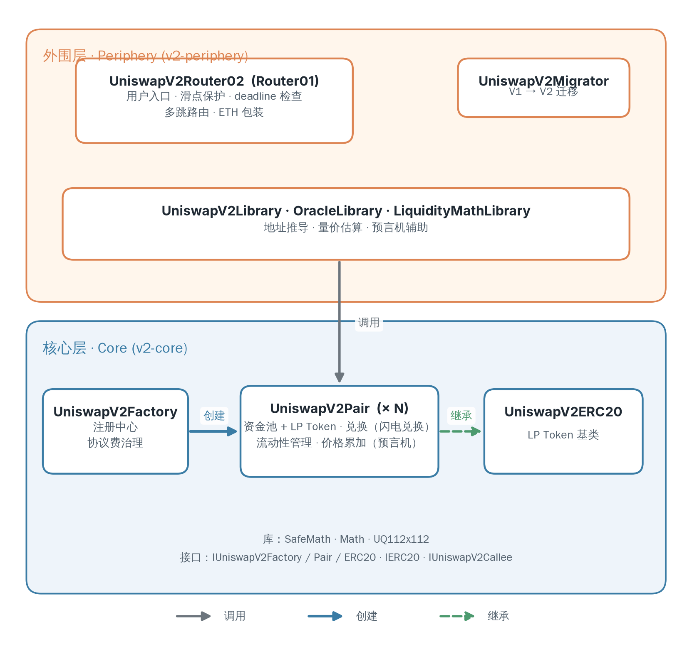

# V2 整体架构

Uniswap V2 的合约代码库分为两层：

- 核心层：只承载最根本、不可变业务逻辑
- 外围层：封装与核心层合约的交互逻辑

本章从整体上勾勒这两层的职责划分与各合约的角色，帮助读者先建立一个全局视图，至于各层合约内部的实现细节，将在后续章节逐一深入。

> [!tip]
> 本章是总览，初学者有些地方暂看不懂没关系，后续章节会逐一剖析所有细节。

## 总览

Uniswap V2 的合约代码库分为两个独立仓库：

- `v2-core`（核心层）。核心层只包含最根本、不可变的业务逻辑，如交易、流动性管理、交易费、协议费计算等，不含任何面向用户的接口；其中有相当一部分代码是对第 1 章公式的实现。核心层一旦部署便不可升级（仅个别治理参数除外），因此它必须把「绝对不能错」的逻辑做到最少、最稳。
- `v2-periphery`（外围层）。外围合约扮演「安全壳」的角色，封装所有用户交互所需的保护逻辑与便利功能：_滑点保护（slippage protection）_ 保证收到的数量不低于可接受下限；_deadline 检查_ 防止交易被延迟打包而按过时价格成交；_多跳路由（multi-hop routing）_ 支持经多个交易对完成 A→B→C 的兑换；ETH 与 WETH 的包装则让用户能用原生 ETH 参与交易。

_图 1　Uniswap V2 的两层架构。外围层（Router、Migrator 与工具库）封装用户交互与安全检查，经工具库调用核心层完成兑换与流动性操作；核心层中 Factory 创建 Pair，Pair 继承 `UniswapV2ERC20` 以发行 LP Token。_

这样设计的好处是：两层可以独立演进。外围层合约能够升级、替换甚至并存多个版本；核心层的极简也使其可作为可信底层，被各类外围乃至第三方协议复用。

## 核心层合约

核心层位于 [v2-core](https://github.com/Uniswap/v2-core) 仓库，其主逻辑合约有三个：

- `contracts/UniswapV2Factory.sol`　Factory 是整个 V2 系统的「注册中心」，负责创建交易对并登记其地址：任何一种新的代币对，都由它部署出一个对应的 Pair 合约，并支持按代币地址查询已创建的 Pair。此外，Factory 还掌管 _协议费（protocol fee）_ 的治理，可指定手续费的接收地址以及有权更改该地址的账户；这一机制（包括协议费默认关闭的原因）将在后续章节展开。

- `contracts/UniswapV2Pair.sol`　每个 Pair 合约代表一个交易对，是 V2 中最核心也最复杂的合约；系统中有多少个交易对，就有多少个状态彼此完全隔离的 Pair 实例。一个 Pair 同时扮演两个角色：它是一个 AMM 资金池，记录两种代币的储备量，并据此执行兑换（含可在同一笔交易内借还的 _闪电兑换（flash swap）_）与流动性管理；它又是一份 ERC20 代币合约，向流动性提供者铸造代表其在资金池中份额的 _流动性代币（LP Token）_，为此它直接继承自下文的 `UniswapV2ERC20`。此外，Pair 还持续累加两种代币的累计价格，为预言机提供原始数据。这些机制的具体实现将在后续章节逐一剖析。

- `contracts/UniswapV2ERC20.sol`　这是一份标准的 ERC20 实现，Pair 合约直接继承自它；流动性提供者拿到的 LP Token 即由它铸造，代表其在资金池中所占的份额。所有 Pair 共享相同的代币名 `Uniswap V2`、符号 `UNI-V2` 与 18 位小数，但每个 Pair 都是独立实例，各自维护发行量与余额。在标准转账与授权之外，它还实现了 _EIP-2612 permit_，允许持有者用一笔链下签名完成授权、省去单独的 approve 交易。

除三个合约外，核心层还包含若干接口与工具库，它们让合约边界清晰、逻辑可复用。接口定义合约对外的公共 API：

- `contracts/interfaces/IUniswapV2Factory.sol`：Factory 的接口，声明交易对的创建、查询与协议费治理相关函数。
- `contracts/interfaces/IUniswapV2Pair.sol`：Pair 的接口，声明储备量读取、流动性管理、兑换与闪电兑换回调等函数。
- `contracts/interfaces/IUniswapV2ERC20.sol`：LP Token 的接口，声明标准 ERC20 方法与 permit。
- `contracts/interfaces/IUniswapV2Callee.sol`：定义兑换时的回调函数 `uniswapV2Call`，正是 Pair 实现闪电兑换所依赖的接口；任何想在兑换过程中被回调的合约，都需实现它。
- `contracts/interfaces/IERC20.sol`：核心层引用外部代币时所用的 ERC20 接口。

工具库不含状态，纯做计算：

- `contracts/libraries/SafeMath.sol`：提供防溢出的安全算术（`add`/`sub`/`mul`）。
- `contracts/libraries/Math.sol`：提供取最小值（`min`）与开方（`sqrt`）。
- `contracts/libraries/UQ112x112.sol`：第 2 章介绍过的 UQ112.112 定点数库，用于价格累加值的计算。

## 外围层合约

外围层位于 [v2-periphery](https://github.com/Uniswap/v2-periphery) 仓库，是用户实际交互的入口。它建立在核心层之上，本身不含 AMM 的根本逻辑；其核心是 Router，此外还有迁移工具与若干工具库。

- `contracts/UniswapV2Router01.sol`　Router 是用户与 V2 打交道的主入口。它本身不做兑换数学，而是把「准备好代币、调用 Pair、校验结果」这套流程封装起来，并叠加核心层刻意省去的安全检查与便利：滑点保护、deadline 检查、多跳路由与 ETH 包装。其接口按功能分为三组：添加与移除流动性、兑换，以及用于链下估算的价格查询。
- `contracts/UniswapV2Router02.sol`　在 `Router01` 基础上新增了对 _转账扣费代币（fee-on-transfer token）_ 的支持，并把函数改为可覆盖以便扩展；新项目通常直接采用 `Router02`。

外围层还提供几个工具库：

- `contracts/libraries/UniswapV2Library.sol`：最为常用，负责代币地址排序（`sortTokens`）、确定性计算 Pair 地址（`pairFor`）、查询储备量（`getReserves`），以及兑换量的正向与反向估算（`getAmountOut`/`getAmountIn` 及其多跳版本 `getAmountsOut`/`getAmountsIn`）。
- `contracts/libraries/UniswapV2OracleLibrary.sol`：面向预言机，封装读取 Pair 累计价格（`currentCumulativePrices`）的辅助逻辑，是构建 _时间加权平均价格（Time-Weighted Average Price, TWAP）_ 预言机的基础；其 TWAP 机制将在后续章节讲解。
- `contracts/libraries/UniswapV2LiquidityMathLibrary.sol`：用于估算一份 LP 份额所对应的代币价值，并可结合套利因素给出抗操纵的估值。

此外，仓库的 `contracts/examples/` 目录还附带了闪电兑换、预言机、兑换到目标价等示例合约，供开发者参考。

## 总结

Uniswap V2 的合约采用两层架构。核心层只承载最根本、不可变的业务逻辑：Factory 作为注册中心创建并登记交易对，Pair 既是 AMM 资金池又发行 LP Token（继承自 `UniswapV2ERC20`），并以极简、不可升级为代价换取可信与可复用。外围层则在核心之上封装用户交互：Router 把准备代币、调用 Pair、校验结果的流程，与滑点保护、deadline 检查、多跳路由、ETH 包装等便利叠加在一起；工具库则提供地址推导、量价估算与预言机辅助。两层各司其职、可独立演进：外围能升级、并存多版本，核心则作为各类外围乃至第三方协议的可信底层。

建立了这个全局视图之后，后续章节将从 Pair 的兑换与流动性管理入手，逐一深入核心层的每个机制，再回到外围层，看 Router 与工具库如何在其上提供便利与保护。
