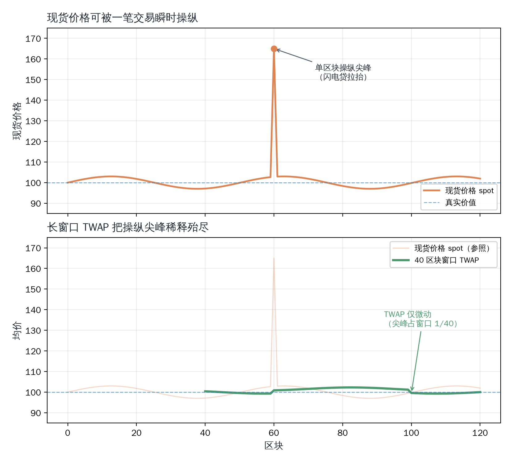

# 预言机

本章展开 Uniswap V2 的 _预言机（oracle）_ 机制。资金池在 `_update` 中顺带累加了两个变量 `price0CumulativeLast` 与 `price1CumulativeLast`，它们正是 V2 提供给外部协议的全部原始价格数据。本章先给出 _时间加权平均价格（Time-Weighted Average Price，TWAP）_ 的定义，再顺着“要计算它需要哪些数据”这一线索，揭示这两个累加器如何记录价格，最后分析 TWAP 为何能抵御单笔交易的操纵。

## 现货价格的脆弱性

许多 DeFi 协议（借贷、衍生品、稳定币等）都需要一个外部价格来决定清算、铸造或结算。Uniswap 的每个 Pair 随时都能给出一个价格：储备量之比 $\text{reserve1}/\text{reserve0}$，即 _现货价格（spot price）_。它获取方便，却极其危险。

问题在于，现货价格可以被一笔交易瞬间改写。攻击者可以借助 _闪电贷（flash loan）_ 借入巨额资金，在单个区块内对 Pair 发起一笔巨大的 `swap`，把现货价格推到极端值；依赖该价格的协议据此做出错误决策（例如放出超额贷款），攻击者再在同笔交易内把价格打回、归还闪电贷。整个过程在一笔交易内完成，攻击者几乎无需承担成本，这就是臭名昭著的预言机操纵攻击。

因此，直接读取现货价格不能用作可信价格源。我们需要一个对“单区块瞬时操纵”免疫的价格：时间加权平均价格。

## 时间加权平均价格

所谓 TWAP，就是把一段时间窗口内的价格按其持续时长加权后求平均。设窗口 $[t_1, t_2]$ 内价格并非恒定，而是分段保持：第 $i$ 段的价格为 $P_i$、持续 $\Delta t_i$，那么该窗口的 TWAP 为：

$$\text{TWAP} = \frac{\sum P_i \cdot \Delta t_i}{\sum \Delta t_i} = \frac{\sum P_i \cdot \Delta t_i}{t_2 - t_1} \tag{1}$$

分母 $\sum \Delta t_i$ 就是窗口总长 $t_2 - t_1$，分子是价格对时间的离散积分。这正是“时间加权”的含义：一个价格维持得越久，它在分子中所占的权重越大、对平均值的影响也越大。

举例：若 token0 的价格在过去 1 小时（3600 秒）内是 2000，随后因一笔大额交易被瞬间打到 2500、并在本区块剩余的 12 秒内维持该值，那么由式 (1)，这 3612 秒窗口的 TWAP 为 $\frac{2000 \times 3600 + 2500 \times 12}{3612} \approx 2001.66$。一笔把价格抬高 25% 的交易，对整个窗口均价的影响却不到 0.1%，因为那个高价尖峰仅占了 3612 秒中的 12 秒。瞬时操纵被时间稀释了。

那么问题自然浮现：要算出这个 TWAP，合约究竟需要为此记录哪些数据？

## 价格累加器

要计算式 (1) 的分子 $\sum P_i \cdot \Delta t_i$，最朴素的办法是把每一段的价格与时长成对地记下来。但这并不现实：储备量随每次 `swap` 变动，价格也随之变化，若逐笔记录，存储开销会随交易数无限膨胀，且无从压缩。

关键的观察是，我们并不关心“每一段”本身，只关心它们的总和。于是可以把“价格 × 时长”不断累加进一个单一的运行变量 $C$，使其在 $t$ 时刻的值正是截至该时刻的价格积分 $C(t) = \sum P_i \cdot \Delta t_i$。任意窗口 $[t_1, t_2]$ 内的分子，就是两个时刻的差值 $C(t_2) - C(t_1)$。这样，合约只需维护一个不断增长的累加器，外部读取者在两端各取一次快照相减，便得到了精确的价格积分，既无需逐笔存储，也无需保存任何历史列表。

这正是 V2 的做法。Pair 在 `_update` 里持续累加价格：

```solidity
// v2-core/contracts/UniswapV2Pair.sol

uint32 timeElapsed = blockTimestamp - blockTimestampLast; // overflow is desired
if (timeElapsed > 0 && _reserve0 != 0 && _reserve1 != 0) {
    // * never overflows, and + overflow is desired
    price0CumulativeLast += uint(UQ112x112.encode(_reserve1).uqdiv(_reserve0)) * timeElapsed;
    price1CumulativeLast += uint(UQ112x112.encode(_reserve0).uqdiv(_reserve1)) * timeElapsed;
}
```

`price0CumulativeLast` 累加的就是“token0 以 token1 计的价格”乘以持续时间，即上面的 $C(t)$。其中 `UQ112x112.encode(_reserve1).uqdiv(_reserve0)` 正是价格 $\text{reserve1}/\text{reserve0}$ 的第 2 章 `UQ112.112` 定点数表示，`timeElapsed` 是自上次更新以来的秒数。于是每个区块**首次**更新储备量时，合约把上一段时间内真正生效的价格乘以它维持了多久，加进累加器：

$$\text{price0CumulativeLast} \mathrel{+}= \frac{\text{reserve1}}{\text{reserve0}} \times \Delta t \tag{2}$$

注意几个要点：

- **每区块只累加一次**：`timeElapsed > 0` 保证只有进入新区块的第一次 `_update` 才累加，避免同一区块内多次交易重复计入
- **用旧储备量计价**：累加用的是 `_reserve0/_reserve1`（更新前的储备量），即“过去这段时间内真正生效的价格”，而非交易后的瞬时价格
- **溢出是有意为之**：累加器存为 `uint`（256 位），会自然回绕。由于外部只用两个时刻的差值，回绕不影响结果，这正是无符号整数差值运算的特性

把式 (2) 代回式 (1)：既然 $C(t_2) - C(t_1)$ 就是分子，那么任意窗口的 TWAP 可由两个时刻的累加器快照直接求出：

$$\text{TWAP} = \frac{\text{price0CumulativeLast}(t_2) - \text{price0CumulativeLast}(t_1)}{t_2 - t_1} \tag{3}$$

这两个累加器构成 Pair 提供的全部预言机数据：Pair 只负责忠实累加，不计算任何平均值，平均的工作完全交给外部读取者（至于读取者如何采样、如何按周期或滑动窗口求得 TWAP，将在分析外围层合约时展开）。

## 抗操纵分析

TWAP 之所以抗操纵，关键在于“时间加权”：要让均价偏移，攻击者必须让偏离的价格**持续存在**，而不仅仅是瞬时出现。



_图 1　TWAP 对单区块操纵的稀释。上：现货价格（细线）在某区块被一笔交易瞬间打到尖峰、随后被套利者拉回，而累计价格（粗线）因这一尖峰只增长了极小一段；下：由此算得的 TWAP（实线）几乎不变，始终贴近真实价值（虚线）。要显著抬高 TWAP，攻击者须让高价持续占据窗口的大段时长。_

攻击者若想在 $T$ 秒的窗口内把 TWAP 抬高 $\delta$，就必须让现货价格在窗口中维持高位累计约 $T \cdot (\delta/\text{偏移幅度})$ 秒。每多维持一个区块，他都要承受两重代价：一是把价格推离均衡所需的巨大价格冲击（资金被锁在亏头仓位里），二是套利者会不断把价格往回拉、从他身上套利。因此操纵成本大致正比于池子流动性 × 窗口时长 × 期望偏移，窗口越长、池子越深，操纵就越昂贵。

这正好封死了闪电贷攻击的根基：闪电贷只能在一笔交易（单个区块）内生效，而单区块的价格尖峰会被长窗口稀释到近乎无感。攻击者无法“借完、操纵、归还”一气呵成，必须把资金和风险暴露在多个区块之上，从而变得不经济。

## 总结

现货价格可被闪电贷在单个区块内瞬时操纵，无法直接用作可信价格源，由此引出对单区块操纵免疫的时间加权平均价格。TWAP 把窗口内的价格按其持续时长加权求平均，价格维持得越久权重越大，转瞬即逝的价格尖峰几乎不影响窗口均价。为算出 TWAP，V2 让 Pair 在 `_update` 中把“价格 × 时长”持续累加进两个累加器，每区块首次更新累加一次、用更新前储备量计价、溢出有意为之；外部读取者在两个时刻各取一次快照相减除以时间差即得 TWAP，Pair 只负责忠实累加。正因如此，操纵 TWAP 必须让偏离的价格持续占据多个区块，其成本大致正比于池子流动性、窗口时长与期望偏移，闪电贷式的单区块攻击便被时间稀释而失效。
